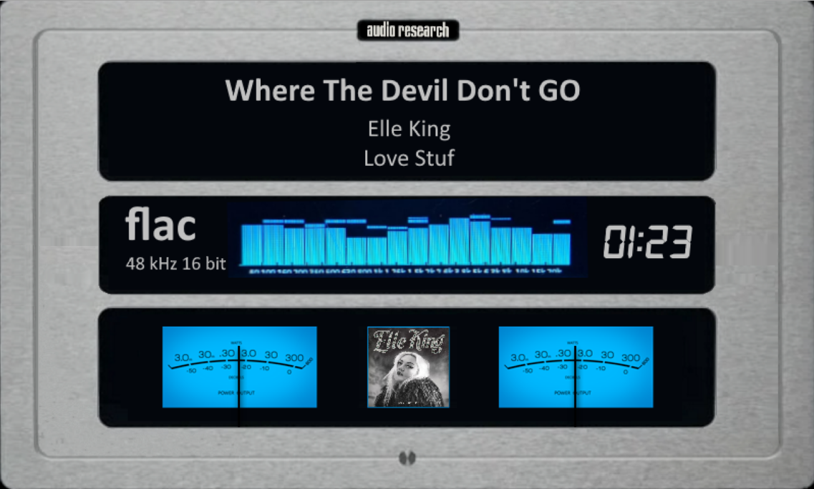
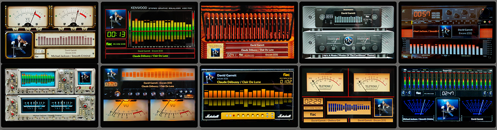

# 0800x480 Templates

All templates available for 0800x480 resolution.

---

## 800x480_crab_01

**Type:** VU Meter

**Meter:** crab_01

**Download:** [800x480_crab_01.zip](../template_peppy/0800/480/800x480_crab_01.zip)

**Install:** Extract and copy folder to `/data/INTERNAL/peppy_screensaver/templates/`

---

## 800x480_custom_01

**Type:** VU Meter

**Meter:** vertical-turntable-blue

**Download:** [800x480_custom_01.zip](../template_peppy/0800/480/800x480_custom_01.zip)

**Install:** Extract and copy folder to `/data/INTERNAL/peppy_screensaver/templates/`

---

## 800x480_custom_02

**Type:** VU Meter

**Meter:** VTEBT-RecordPlayer

**Download:** [800x480_custom_02.zip](../template_peppy/0800/480/800x480_custom_02.zip)

**Install:** Extract and copy folder to `/data/INTERNAL/peppy_screensaver/templates/`

---

## 800x480_custom_03

**Type:** VU Meter

**Meter:** Bang-Olufsen

**Download:** [800x480_custom_03.zip](../template_peppy/0800/480/800x480_custom_03.zip)

**Install:** Extract and copy folder to `/data/INTERNAL/peppy_screensaver/templates/`

---

## 800x480_custom_04

**Type:** VU Meter

**Meter:** black-grey-square

**Download:** [800x480_custom_04.zip](../template_peppy/0800/480/800x480_custom_04.zip)

**Install:** Extract and copy folder to `/data/INTERNAL/peppy_screensaver/templates/`

---

## 800x480_custom_05

**Type:** VU Meter

**Meter:** black-blue-square

**Download:** [800x480_custom_05.zip](../template_peppy/0800/480/800x480_custom_05.zip)

**Install:** Extract and copy folder to `/data/INTERNAL/peppy_screensaver/templates/`

---

## 800x480_custom_06

**Type:** VU Meter

**Meter:** RecordPlayer

**Download:** [800x480_custom_06.zip](../template_peppy/0800/480/800x480_custom_06.zip)

**Install:** Extract and copy folder to `/data/INTERNAL/peppy_screensaver/templates/`

---

## 800x480_custom_07

**Type:** VU Meter

**Meter:** Esoteric-T1

**Download:** [800x480_custom_07.zip](../template_peppy/0800/480/800x480_custom_07.zip)

**Install:** Extract and copy folder to `/data/INTERNAL/peppy_screensaver/templates/`

---

## 800x480_custom_08

**Type:** VU Meter

**Meter:** BrystonBI200

**Download:** [800x480_custom_08.zip](../template_peppy/0800/480/800x480_custom_08.zip)

**Install:** Extract and copy folder to `/data/INTERNAL/peppy_screensaver/templates/`

---

## 800x480_custom_09

**Type:** VU Meter

**Meter:** cassettedeck-2

**Download:** [800x480_custom_09.zip](../template_peppy/0800/480/800x480_custom_09.zip)

**Install:** Extract and copy folder to `/data/INTERNAL/peppy_screensaver/templates/`

---

## 800x480_custom_10

**Type:** VU Meter

**Meter:** cassettedeck-3

**Download:** [800x480_custom_10.zip](../template_peppy/0800/480/800x480_custom_10.zip)

**Install:** Extract and copy folder to `/data/INTERNAL/peppy_screensaver/templates/`

---

## 800x480_custom_13

**Type:** VU Meter

**Meter:** Volumio

**Download:** [800x480_custom_13.zip](../template_peppy/0800/480/800x480_custom_13.zip)

**Install:** Extract and copy folder to `/data/INTERNAL/peppy_screensaver/templates/`

---

## 800x480_custom_14

**Type:** VU Meter

**Meter:** BandRecorder-1

**Download:** [800x480_custom_14.zip](../template_peppy/0800/480/800x480_custom_14.zip)

**Install:** Extract and copy folder to `/data/INTERNAL/peppy_screensaver/templates/`

---

## 800x480_dan_dagostimo_mlife

**Type:** VU Meter

**Meter:** dan_dagostino_mlife

**Download:** [800x480_dan_dagostimo_mlife.zip](../template_peppy/0800/480/800x480_dan_dagostimo_mlife.zip)

**Install:** Extract and copy folder to `/data/INTERNAL/peppy_screensaver/templates/`

---

## 800x480_dandagostino_1

**Type:** VU Meter

**Meter:** dan-dagostino

**Download:** [800x480_dandagostino_1.zip](../template_peppy/0800/480/800x480_dandagostino_1.zip)

**Install:** Extract and copy folder to `/data/INTERNAL/peppy_screensaver/templates/`

---

## 800x480_south_park

**Type:** VU Meter

**Meter:** southpark

**Download:** [800x480_south_park.zip](../template_peppy/0800/480/800x480_south_park.zip)

**Install:** Extract and copy folder to `/data/INTERNAL/peppy_screensaver/templates/`

---

## 800x480_south_park_2

**Type:** VU Meter

**Meter:** southpark2

**Download:** [800x480_south_park_2.zip](../template_peppy/0800/480/800x480_south_park_2.zip)

**Install:** Extract and copy folder to `/data/INTERNAL/peppy_screensaver/templates/`

---

## 800x480_as200-1custom_12

**Type:** Combined

**Meter:** AudioResearch-S200-1

**Download:** [800x480_as200-1custom_12.zip](../templates_peppy_spectrum/0800/480/800x480_as200-1custom_12.zip)

**Install (both required):**
1. Extract the zip file
2. Copy `templates/800x480_as200-1custom_12/` to `/data/INTERNAL/peppy_screensaver/templates/`
3. Copy `templates_spectrum/800x480_as200-1custom_12/` to `/data/INTERNAL/peppy_screensaver/templates_spectrum/`

---

## 800x480_as200custom_11

**Type:** Combined

**Meter:** AudioResearch-S200-2

**Download:** [800x480_as200custom_11.zip](../templates_peppy_spectrum/0800/480/800x480_as200custom_11.zip)

**Install (both required):**
1. Extract the zip file
2. Copy `templates/800x480_as200custom_11/` to `/data/INTERNAL/peppy_screensaver/templates/`
3. Copy `templates_spectrum/800x480_as200custom_11/` to `/data/INTERNAL/peppy_screensaver/templates_spectrum/`

---

## 800x480_dan_dagostino_mlife

**Type:** Combined

**Meter:** dan_dagostino_mlife

**Download:** [800x480_dan_dagostino_mlife.zip](../templates_peppy_spectrum/0800/480/800x480_dan_dagostino_mlife.zip)

**Install (both required):**
1. Extract the zip file
2. Copy `templates/800x480_dan_dagostino_mlife/` to `/data/INTERNAL/peppy_screensaver/templates/`
3. Copy `templates_spectrum/800x480_dan_dagostino_mlife/` to `/data/INTERNAL/peppy_screensaver/templates_spectrum/`

---

## 800x480_g5_1020_sm

**Type:** Combined

**Included Meters (10):**

- 101G5_475A Oscil S+M
- 102G5_Free S+M
- 103G5_Kenwood Spectrum
- 104G5_Kenwood Rev S+M
- 105G5_OldPipe Spectrum
- 106G5_Marschal Spectrum
- 107G5_Marantz S+M
- 108G5_Teletronix S+M
- 109G5_Corrector S+M
- 110G5_Sansui S+M

**Download:** [800x480_g5_1020_sm.zip](../templates_peppy_spectrum/0800/480/800x480_g5_1020_sm.zip)

**Install (both required):**
1. Extract the zip file
2. Copy `templates/800x480_g5_1020_sm/` to `/data/INTERNAL/peppy_screensaver/templates/`
3. Copy `templates_spectrum/800x480_g5_1020_sm/` to `/data/INTERNAL/peppy_screensaver/templates_spectrum/`

---

