# 1280x400 Templates

All templates available for 1280x400 resolution.

---

## 1280x400_Aluminium_frame_01

**Type:** VU Meter

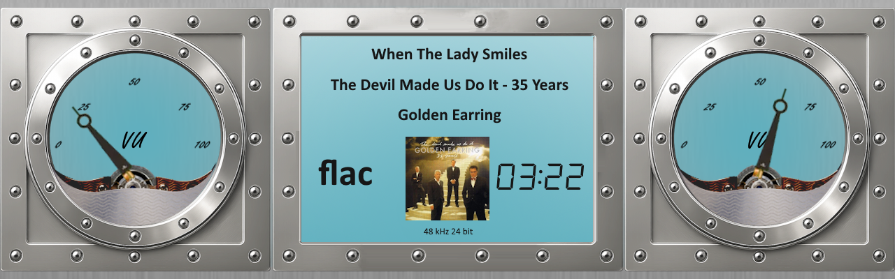

**Meter:** Aluminium_frame

**Download:** [1280x400_Aluminium_frame_01.zip](../template_peppy/1280/400/1280x400_Aluminium_frame_01.zip)

**Install:** Extract and copy folder to `/data/INTERNAL/peppy_screensaver/templates/`

---

## 1280x400_Aluminium_green_02

**Type:** VU Meter

**Meter:** Aluminium_frame_green

**Download:** [1280x400_Aluminium_green_02.zip](../template_peppy/1280/400/1280x400_Aluminium_green_02.zip)

**Install:** Extract and copy folder to `/data/INTERNAL/peppy_screensaver/templates/`

---

## 1280x400_Aluminium_orange_03

**Type:** VU Meter

**Meter:** Aluminium_frame_orange

**Download:** [1280x400_Aluminium_orange_03.zip](../template_peppy/1280/400/1280x400_Aluminium_orange_03.zip)

**Install:** Extract and copy folder to `/data/INTERNAL/peppy_screensaver/templates/`

---

## 1280x400_MomentumMxV

**Type:** VU Meter

**Meter:** Dan-Dagostino-MomentumMxV

**Download:** [1280x400_MomentumMxV.zip](../template_peppy/1280/400/1280x400_MomentumMxV.zip)

**Install:** Extract and copy folder to `/data/INTERNAL/peppy_screensaver/templates/`

---

## 1280x400_PMN_LedStrypes

**Type:** VU Meter

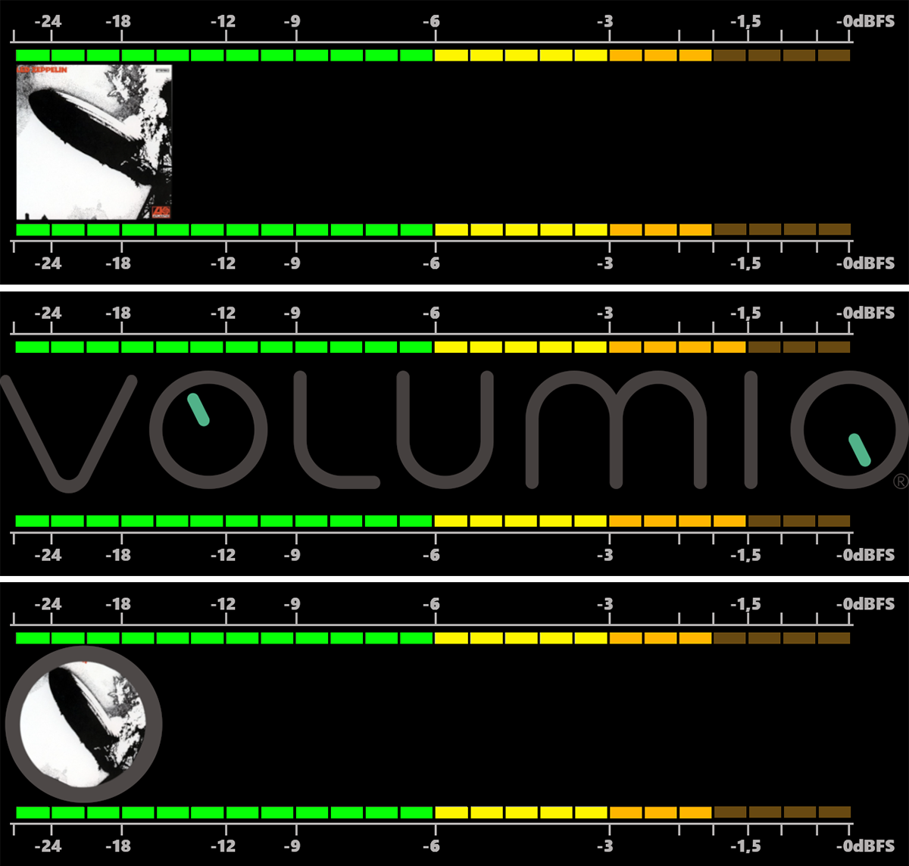

**Included Meters (3):**

- 01PMN_Led Strypes (With Meters-Calibrated)
- 02PMN_Led Strypes (With Meters-Calibrated-Metadata Rotation)
- 03PMN_Led Strypes (With Meters-Calibrated-Metadata)

**Download:** [1280x400_PMN_LedStrypes.zip](../template_peppy/1280/400/1280x400_PMN_LedStrypes.zip)

**Install:** Extract and copy folder to `/data/INTERNAL/peppy_screensaver/templates/`

---

## 1280x400_black_blue_square

**Type:** VU Meter

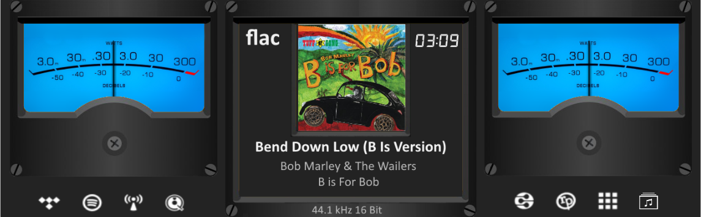

**Meter:** black-blue-square

**Download:** [1280x400_black_blue_square.zip](../template_peppy/1280/400/1280x400_black_blue_square.zip)

**Install:** Extract and copy folder to `/data/INTERNAL/peppy_screensaver/templates/`

---

## 1280x400_black_white_arrow_bottom

**Type:** VU Meter

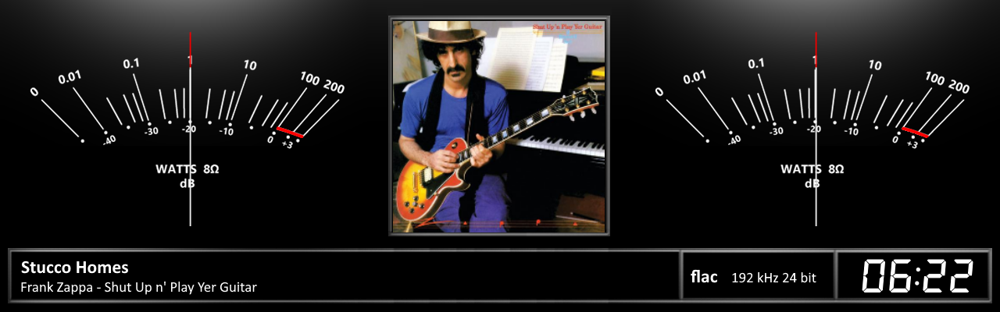

**Meter:** black-white-arrow-bottom

**Download:** [1280x400_black_white_arrow_bottom.zip](../template_peppy/1280/400/1280x400_black_white_arrow_bottom.zip)

**Install:** Extract and copy folder to `/data/INTERNAL/peppy_screensaver/templates/`

---

## 1280x400_black_white_arrow_top

**Type:** VU Meter

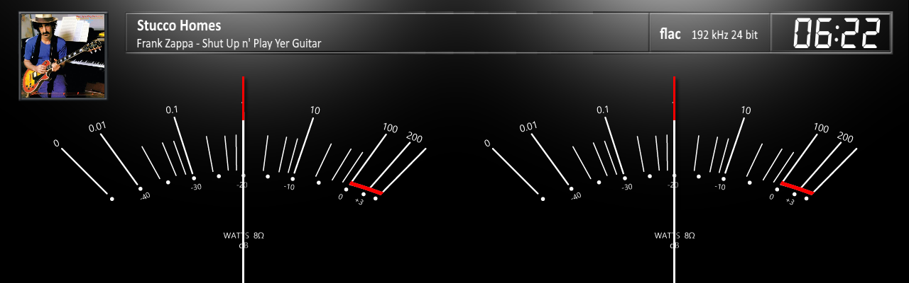

**Meter:** black-white-arrow-top

**Download:** [1280x400_black_white_arrow_top.zip](../template_peppy/1280/400/1280x400_black_white_arrow_top.zip)

**Install:** Extract and copy folder to `/data/INTERNAL/peppy_screensaver/templates/`

---

## 1280x400_bo_beosound9000

**Type:** VU Meter

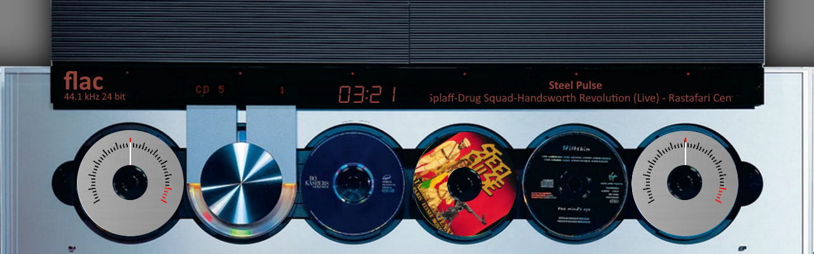

**Meter:** bo_beosound9000

**Download:** [1280x400_bo_beosound9000.zip](../template_peppy/1280/400/1280x400_bo_beosound9000.zip)

**Install:** Extract and copy folder to `/data/INTERNAL/peppy_screensaver/templates/`

---

## 1280x400_cyrus_40_st

**Type:** VU Meter

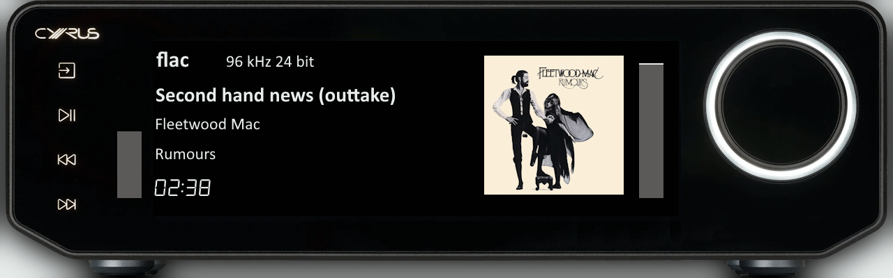

**Meter:** Cyrus_40_st

**Download:** [1280x400_cyrus_40_st.zip](../template_peppy/1280/400/1280x400_cyrus_40_st.zip)

**Install:** Extract and copy folder to `/data/INTERNAL/peppy_screensaver/templates/`

---

## 1280x400_dan_dagostimo_mlife

**Type:** VU Meter

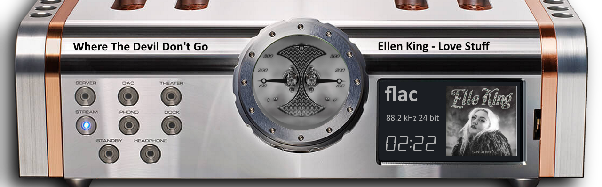

**Meter:** dan_dagostimo_mlife

**Download:** [1280x400_dan_dagostimo_mlife.zip](../template_peppy/1280/400/1280x400_dan_dagostimo_mlife.zip)

**Install:** Extract and copy folder to `/data/INTERNAL/peppy_screensaver/templates/`

---

## 1280x400_esoteric-grandioso-t1

**Type:** VU Meter

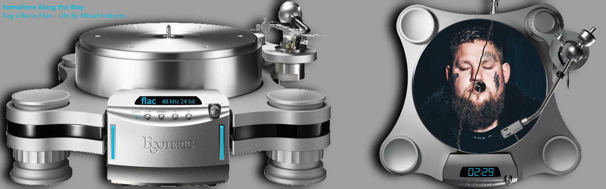

**Meter:** esoteric-grandioso-t1

**Download:** [1280x400_esoteric-grandioso-t1.zip](../template_peppy/1280/400/1280x400_esoteric-grandioso-t1.zip)

**Install:** Extract and copy folder to `/data/INTERNAL/peppy_screensaver/templates/`

---

## 1280x400_g5_201_meters

**Type:** VU Meter

**Included Meters (20):**

- 01G5_Naim
- 02G5_Naim 2
- 03G5_McIntosh
- 04G5_Accuphase
- 05G5_Luxman
- 06G5_Technics TX30
- 07G5_Technics_silver
- 08G5_Technics_Black
- 09G5_Advence
- 10G5_Advance2
- 11G5_Adv_X220
- 12G5_Sony TA-N77
- 13G5_Onkyo 5570
- 14G5_Krell KAS
- 15G5_T+A 3000HV
- 16G5_Turnable Black B
- 17G5_TurnOld
- 18G5_Turnable Black
- 19G5_Turnable Green
- 20G5_Turnable Blue

**Download:** [1280x400_g5_201_meters.zip](../template_peppy/1280/400/1280x400_g5_201_meters.zip)

**Install:** Extract and copy folder to `/data/INTERNAL/peppy_screensaver/templates/`

---

## 1280x400_g5_202_meters

**Type:** VU Meter

**Included Meters (20):**

- 21G5_Audio Research
- 22G5_BlackBlur
- 23G5_BlueSea_Black
- 24G5_Bocatech
- 25G5_Classe
- 26G5_Dagostino
- 27G5_Kenwood Rev
- 28G5_Kenwood Single
- 29G5_Klanghelm
- 30G5_Caltec
- 31G5_Alvin
- 32G5_Magnetcord
- 33G5_NAD C3050
- 34G5_Onvi
- 35G5_Onvi centre
- 36G5_Old Braun
- 37G5_PeppyP Bang
- 38G5_WestonHouse
- 39G5_Weston
- 40G5_Retro

**Download:** [1280x400_g5_202_meters.zip](../template_peppy/1280/400/1280x400_g5_202_meters.zip)

**Install:** Extract and copy folder to `/data/INTERNAL/peppy_screensaver/templates/`

---

## 1280x400_g5_203_meters

**Type:** VU Meter

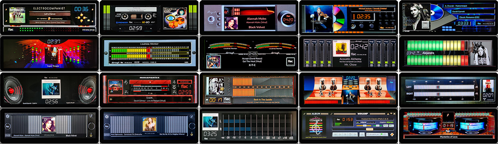

**Included Meters (20):**

- 41G5_Abrahamsen
- 42G5_Casette Full
- 43G5_Cayin
- 44G5_CD Cover
- 45G5_SACD Cover
- 46G5_Disco
- 47G5_Dorrough Vertical
- 48G5_Dorrough crooked
- 49G5_Dorrought horizon
- 50G5_Led Strips
- 51G5_Loudspeaker IN
- 52G5_MarantzCD
- 53G5_Sansui
- 54G5_Unison Research
- 55G5_Rose3 Line
- 56G5_Rose IN
- 57G5_Rose OUT
- 58G5_TechnicsLed
- 59G5_Winamp
- 60G5_Eher

**Download:** [1280x400_g5_203_meters.zip](../template_peppy/1280/400/1280x400_g5_203_meters.zip)

**Install:** Extract and copy folder to `/data/INTERNAL/peppy_screensaver/templates/`

---

## 1280x400_g5_204_meters

**Type:** VU Meter

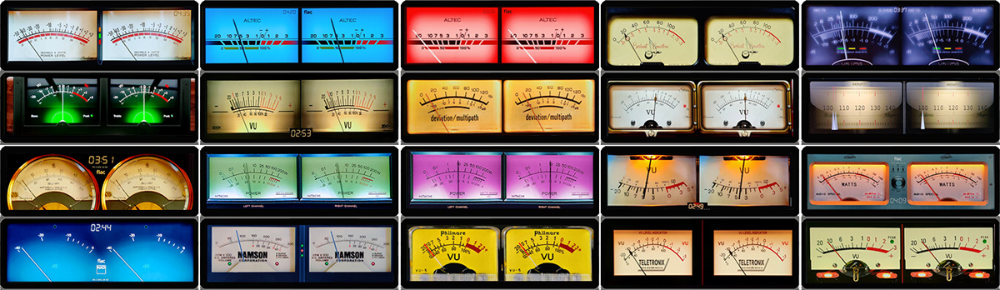

**Included Meters (20):**

- 61G5_Old Accuphase Only
- 62G5_Caltec Blue
- 63G5_Caltec Red
- 64G5_Berlant Only
- 65G5_BlackBlur only meters
- 66G5_Dark Spotify Only
- 67G5_Denon Only
- 68G5_Deviation Only
- 69G5_DF202 Only meters
- 70G5_Gemonti ONLY meters
- 71G5_Hartman Only
- 72G5_Hitachi7500 ONLY meters
- 73G5_Hitachi7500 Purple
- 74G5_Kenwood Rev only meters
- 75G5_Line Magnetic
- 76G5_NAD M10 only
- 77G5_Namson Only meters
- 78G5_Philmore Only
- 79G5_Teletronix Only
- 80G5_VU Peak Only

**Download:** [1280x400_g5_204_meters.zip](../template_peppy/1280/400/1280x400_g5_204_meters.zip)

**Install:** Extract and copy folder to `/data/INTERNAL/peppy_screensaver/templates/`

---

## 1280x400_g5_205_meters

**Type:** VU Meter

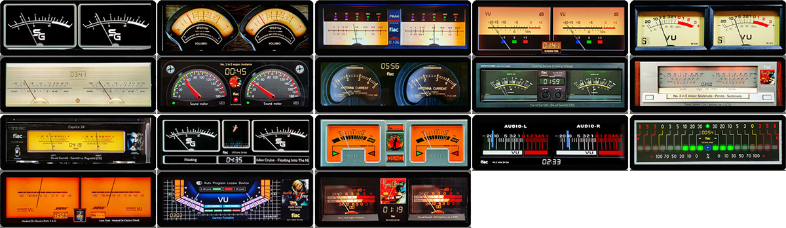

**Included Meters (18):**

- 81G5_SG Only meters
- 82G5_Weston ONLY meters
- 83G5_Realistic
- 84G5_Rudeer Only
- 85G5_R55 Only
- 86G5_Round 180
- 87G5_Yamaha S3000 Only
- 88G5_WestonHouse Only
- 89G5_OnkyoM508
- 90G5_Yamaha MX2000
- 91G5_Teac
- 92G5_SG
- 93G5_BOSS Orange
- 94G5_Tascam
- 95G5_LED Out ONLY
- 96G5_Bose Rev
- 97G5_Sharp
- 98G5_TCD Deck

**Download:** [1280x400_g5_205_meters.zip](../template_peppy/1280/400/1280x400_g5_205_meters.zip)

**Install:** Extract and copy folder to `/data/INTERNAL/peppy_screensaver/templates/`

---

## 1280x400_mcintosh_mx100

**Type:** VU Meter

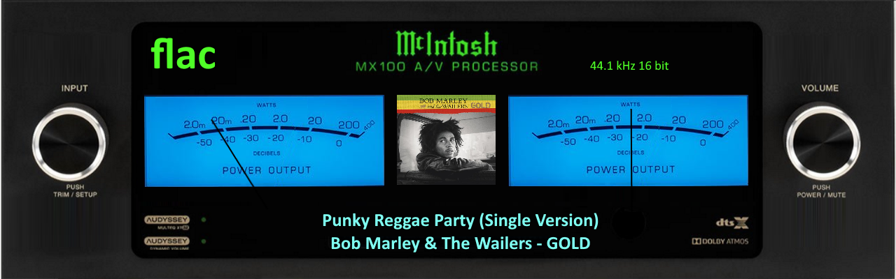

**Meter:** mcintosh_mx100

**Download:** [1280x400_mcintosh_mx100.zip](../template_peppy/1280/400/1280x400_mcintosh_mx100.zip)

**Install:** Extract and copy folder to `/data/INTERNAL/peppy_screensaver/templates/`

---

## 1280x400_nad_6100

**Type:** VU Meter

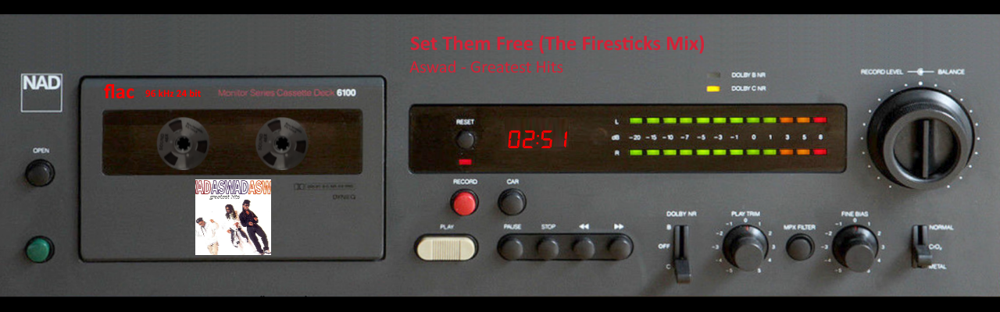

**Meter:** nad-6100

**Download:** [1280x400_nad_6100.zip](../template_peppy/1280/400/1280x400_nad_6100.zip)

**Install:** Extract and copy folder to `/data/INTERNAL/peppy_screensaver/templates/`

---

## 1280x400_nad_6325

**Type:** VU Meter

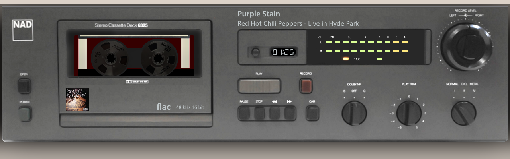

**Meter:** nad-6325

**Download:** [1280x400_nad_6325.zip](../template_peppy/1280/400/1280x400_nad_6325.zip)

**Install:** Extract and copy folder to `/data/INTERNAL/peppy_screensaver/templates/`

---

## 1280x400_nad_d3045

**Type:** VU Meter

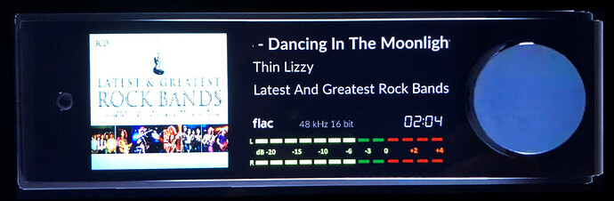

**Meter:** nad-d3045

**Download:** [1280x400_nad_d3045.zip](../template_peppy/1280/400/1280x400_nad_d3045.zip)

**Install:** Extract and copy folder to `/data/INTERNAL/peppy_screensaver/templates/`

---

## 1280x400_nad_m10_1

**Type:** VU Meter

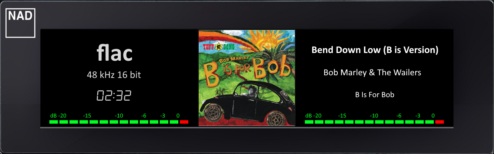

**Meter:** nad-m10-1

**Download:** [1280x400_nad_m10_1.zip](../template_peppy/1280/400/1280x400_nad_m10_1.zip)

**Install:** Extract and copy folder to `/data/INTERNAL/peppy_screensaver/templates/`

---

## 1280x400_nad_m10_2

**Type:** VU Meter

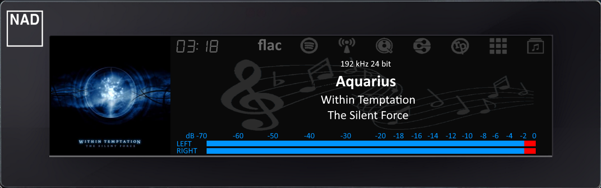

**Meter:** nad-m10-2

**Download:** [1280x400_nad_m10_2.zip](../template_peppy/1280/400/1280x400_nad_m10_2.zip)

**Install:** Extract and copy folder to `/data/INTERNAL/peppy_screensaver/templates/`

---

## 1280x400_nad_m10_3

**Type:** VU Meter

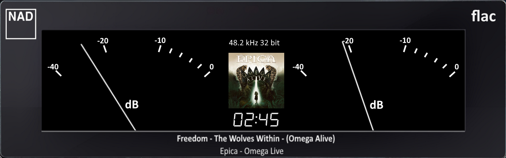

**Meter:** nad-m10-3

**Download:** [1280x400_nad_m10_3.zip](../template_peppy/1280/400/1280x400_nad_m10_3.zip)

**Install:** Extract and copy folder to `/data/INTERNAL/peppy_screensaver/templates/`

---

## 1280x400_nad_m33_1

**Type:** VU Meter

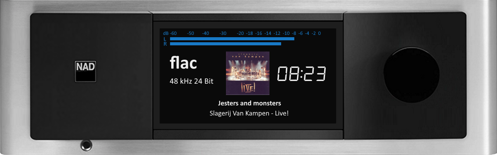

**Meter:** nad-m33-1

**Download:** [1280x400_nad_m33_1.zip](../template_peppy/1280/400/1280x400_nad_m33_1.zip)

**Install:** Extract and copy folder to `/data/INTERNAL/peppy_screensaver/templates/`

---

## 1280x400_rose_rs150

**Type:** VU Meter

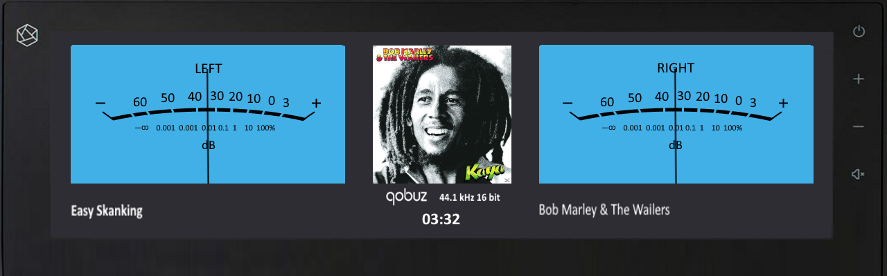

**Meter:** rose-rs150

**Download:** [1280x400_rose_rs150.zip](../template_peppy/1280/400/1280x400_rose_rs150.zip)

**Install:** Extract and copy folder to `/data/INTERNAL/peppy_screensaver/templates/`

---

## 1280x400_rose_rs250

**Type:** VU Meter

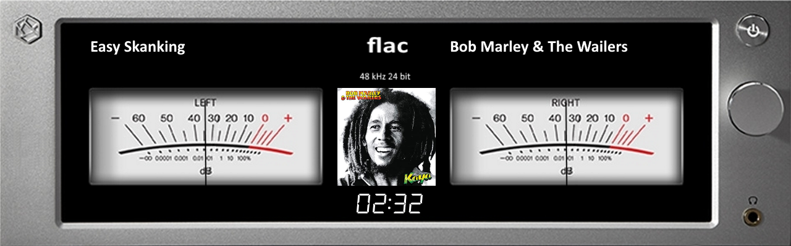

**Meter:** rose-rs250

**Download:** [1280x400_rose_rs250.zip](../template_peppy/1280/400/1280x400_rose_rs250.zip)

**Install:** Extract and copy folder to `/data/INTERNAL/peppy_screensaver/templates/`

---

## 1280x400_technics_SUR1000

**Type:** VU Meter

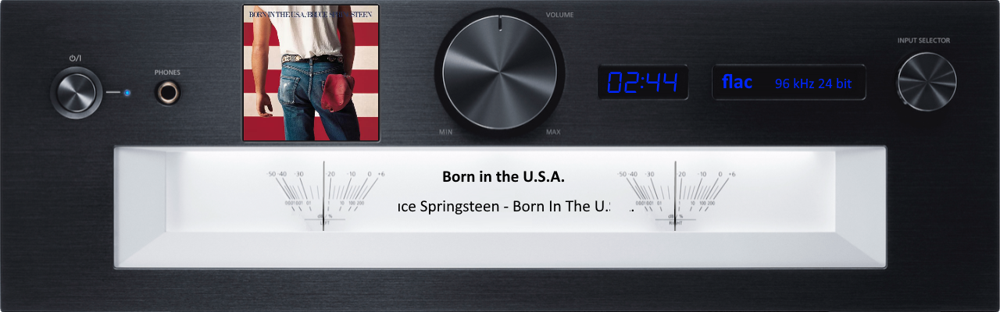

**Meter:** technics

**Download:** [1280x400_technics_SUR1000.zip](../template_peppy/1280/400/1280x400_technics_SUR1000.zip)

**Install:** Extract and copy folder to `/data/INTERNAL/peppy_screensaver/templates/`

---

## 1280x400_volumio1

**Type:** VU Meter

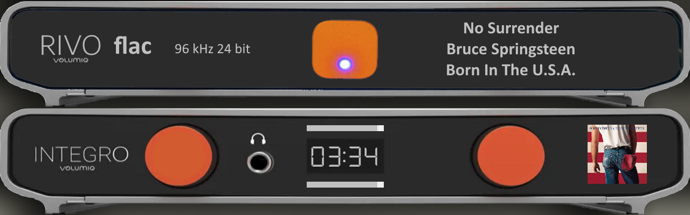

**Meter:** volumio2

**Download:** [1280x400_volumio1.zip](../template_peppy/1280/400/1280x400_volumio1.zip)

**Install:** Extract and copy folder to `/data/INTERNAL/peppy_screensaver/templates/`

---

## 1280x400_Aluminium_spec_blue_04

**Type:** Combined

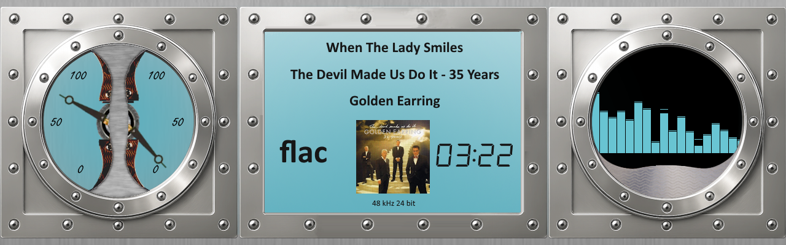

**Meter:** Aluminium_frame_blue_spec

**Download:** [1280x400_Aluminium_spec_blue_04.zip](../templates_peppy_spectrum/1280/400/1280x400_Aluminium_spec_blue_04.zip)

**Install (both required):**
1. Extract the zip file
2. Copy `templates/1280x400_Aluminium_spec_blue_04/` to `/data/INTERNAL/peppy_screensaver/templates/`
3. Copy `templates_spectrum/1280x400_Aluminium_spec_blue_04/` to `/data/INTERNAL/peppy_screensaver/templates_spectrum/`

---

## 1280x400_Aluminium_spec_green_06

**Type:** Combined

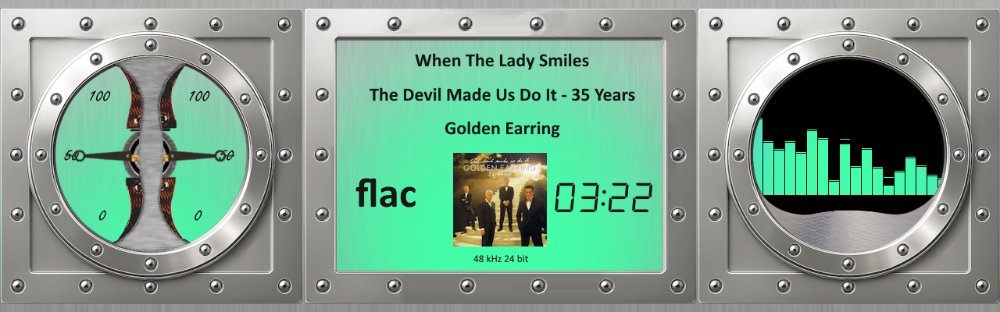

**Meter:** Aluminium_frame_green_spec

**Download:** [1280x400_Aluminium_spec_green_06.zip](../templates_peppy_spectrum/1280/400/1280x400_Aluminium_spec_green_06.zip)

**Install (both required):**
1. Extract the zip file
2. Copy `templates/1280x400_Aluminium_spec_green_06/` to `/data/INTERNAL/peppy_screensaver/templates/`
3. Copy `templates_spectrum/1280x400_Aluminium_spec_green_06/` to `/data/INTERNAL/peppy_screensaver/templates_spectrum/`

---

## 1280x400_Aluminium_spec_orange_05

**Type:** Combined

**Meter:** Aluminium_frame_orange_spec

**Download:** [1280x400_Aluminium_spec_orange_05.zip](../templates_peppy_spectrum/1280/400/1280x400_Aluminium_spec_orange_05.zip)

**Install (both required):**
1. Extract the zip file
2. Copy `templates/1280x400_Aluminium_spec_orange_05/` to `/data/INTERNAL/peppy_screensaver/templates/`
3. Copy `templates_spectrum/1280x400_Aluminium_spec_orange_05/` to `/data/INTERNAL/peppy_screensaver/templates_spectrum/`

---

## 1280x400_g5_210_ms

**Type:** Combined

**Included Meters (20):**

- 101G5_Kenwood S+M
- 102G5_Naim S+M
- 103G5_CD Cover S+M
- 104G5_KeySlight S+M
- 105G5_Marschal S+M
- 106G5_Teletronix S+M
- 107G5_Rhode Spectrum
- 108G5_Kenwood Spectrum
- 109G5_Nixie Spectrum
- 110G5_Nixie2 Spectrum
- 111G5_PipeWood Spectrum
- 112G5_Osciloscope S+M
- 113G5_475A OscSpectrum
- 114G5_Pioneer S+M
- 115G5_Marantz S+M
- 116G5_Corrector Spectrum
- 117G5_ONKYO S+M
- 118G5_Advance S+M
- 119G5_PeppyP S+M
- 120G5_Sansui

**Download:** [1280x400_g5_210_ms.zip](../templates_peppy_spectrum/1280/400/1280x400_g5_210_ms.zip)

**Install (both required):**
1. Extract the zip file
2. Copy `templates/1280x400_g5_210_ms/` to `/data/INTERNAL/peppy_screensaver/templates/`
3. Copy `templates_spectrum/1280x400_g5_210_ms/` to `/data/INTERNAL/peppy_screensaver/templates_spectrum/`

---

