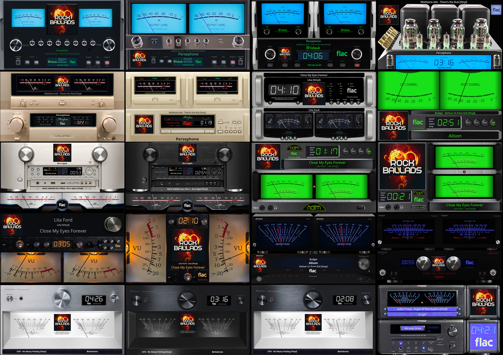
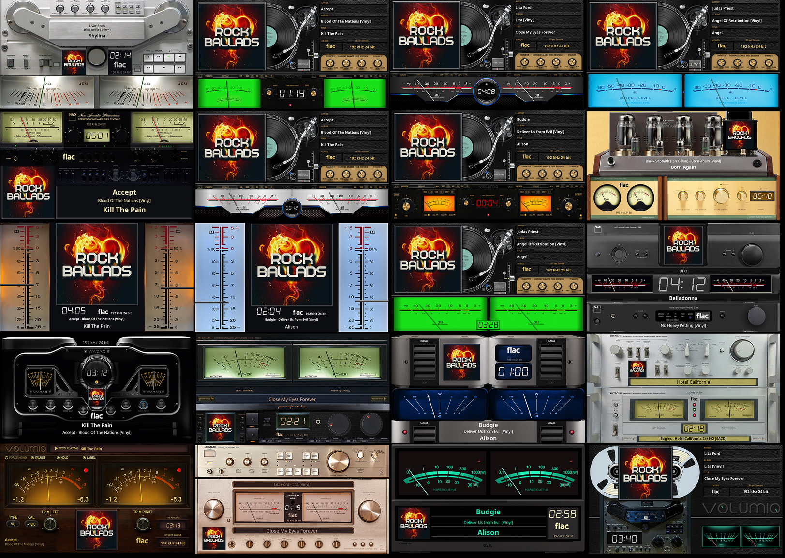
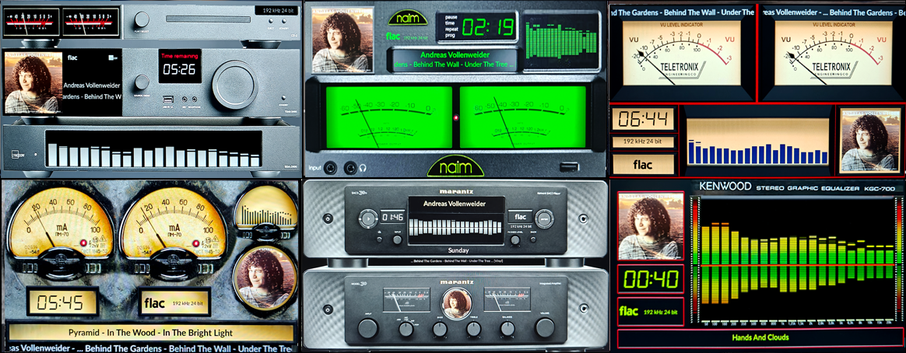

# 1280x720 Templates

All templates available for 1280x720 resolution.

---

## 1280x720_PMN_LedStrypes

**Type:** VU Meter

**Included Meters (5):**

- 01PMN_Led Strypes (With Meters-Calibrated)
- 02PMN_Led Strypes (With Meters-Calibrated-Metadata Rotation) v1
- 03PMN_Led Strypes (With Meters-Calibrated-Metadata Rotation) v2
- 04PMN_Led Strypes (With Meters-Calibrated-Metadata) v1
- 05PMN_Led Strypes (With Meters-Calibrated-Metadata) v2

**Download:** [1280x720_PMN_LedStrypes.zip](../template_peppy/1280/720/1280x720_PMN_LedStrypes.zip)

**Install:** Extract and copy folder to `/data/INTERNAL/peppy_screensaver/templates/`

---

## 1280x720_Pioneer_PLX-500

**Type:** VU Meter

**Meter:** Pioneer PLX-500

**Download:** [1280x720_Pioneer_PLX-500.zip](../template_peppy/1280/720/1280x720_Pioneer_PLX-500.zip)

**Install:** Extract and copy folder to `/data/INTERNAL/peppy_screensaver/templates/`

---

## 1280x720_Pioneer_PLX-500L

**Type:** VU Meter

**Meter:** Pioneer PLX-500 Lite

**Download:** [1280x720_Pioneer_PLX-500L.zip](../template_peppy/1280/720/1280x720_Pioneer_PLX-500L.zip)

**Install:** Extract and copy folder to `/data/INTERNAL/peppy_screensaver/templates/`

---

## 1280x720_custom_01

**Type:** VU Meter

**Meter:** vertical-turntable-blue

**Download:** [1280x720_custom_01.zip](../template_peppy/1280/720/1280x720_custom_01.zip)

**Install:** Extract and copy folder to `/data/INTERNAL/peppy_screensaver/templates/`

---

## 1280x720_custom_02

**Type:** VU Meter

**Meter:** VTEBT-RecordPlayer

**Download:** [1280x720_custom_02.zip](../template_peppy/1280/720/1280x720_custom_02.zip)

**Install:** Extract and copy folder to `/data/INTERNAL/peppy_screensaver/templates/`

---

## 1280x720_custom_06

**Type:** VU Meter

**Meter:** RecordPlayer

**Download:** [1280x720_custom_06.zip](../template_peppy/1280/720/1280x720_custom_06.zip)

**Install:** Extract and copy folder to `/data/INTERNAL/peppy_screensaver/templates/`

---

## 1280x720_g5_440_meters

**Type:** VU Meter

**Included Meters (4):**

- 01G5_Tascam Reel
- 02G5_McIntosh Hybrid
- 03G5_TDK Reel
- 04G5_Free

**Download:** [1280x720_g5_440_meters.zip](../template_peppy/1280/720/1280x720_g5_440_meters.zip)

**Install:** Extract and copy folder to `/data/INTERNAL/peppy_screensaver/templates/`

---

## 1280x720_g5_441_meters

**Type:** VU Meter

**Included Meters (6):**

- 05G5_Hitachi HMA7500 Black
- 06G5_Klanghelm
- 07G5_Technisc_Black
- 08G5_Akai Reverse
- 09G5_Sansui
- 10G5_Casette Full

**Download:** [1280x720_g5_441_meters.zip](../template_peppy/1280/720/1280x720_g5_441_meters.zip)

**Install:** Extract and copy folder to `/data/INTERNAL/peppy_screensaver/templates/`

---

## 1280x720_g5_442_meters

**Type:** VU Meter

**Included Meters (6):**

- 11G5_Kenwood Rev
- 12G5_T+A
- 13G5_Accuphase monoblock
- 14G5_Old2 braun
- 15G5_Hartman
- 16G5_Rehringer

**Download:** [1280x720_g5_442_meters.zip](../template_peppy/1280/720/1280x720_g5_442_meters.zip)

**Install:** Extract and copy folder to `/data/INTERNAL/peppy_screensaver/templates/`

---

## 1280x720_g5_444_rotate

**Type:** VU Meter

**Meter:** 18G5_Streamer CD

**Download:** [1280x720_g5_444_rotate.zip](../template_peppy/1280/720/1280x720_g5_444_rotate.zip)

**Install:** Extract and copy folder to `/data/INTERNAL/peppy_screensaver/templates/`

---

## 1280x720_g5_701_meters

**Type:** VU Meter

**Included Meters (20):**

- 01G5_McIntosh
- 02G5_McIntosh Hybrid
- 03G5_McIntosh Monoblock
- 04G5_McIntosh Tube
- 05G5_Accuphase
- 06G5_Accuphase Monoblock
- 07G5_Marantz Silver
- 08G5_Marantz Black
- 09G5_Technics1600_Silver
- 10G5_Technics1600_Black
- 11G5_Technics1600_Black-Silver
- 12G5_Audio Research
- 13G5_Kenwood Reverse
- 14G5_Kenwood Ver
- 15G5_Naim green
- 16G5_Naim2
- 17G5_Naim Reverse
- 18G5_Advanced X220
- 19G5_Advanced X220EVO
- 20G5_Advanced Combi

**Download:** [1280x720_g5_701_meters.zip](../template_peppy/1280/720/1280x720_g5_701_meters.zip)

**Install:** Extract and copy folder to `/data/INTERNAL/peppy_screensaver/templates/`

---

## 1280x720_g5_702_meters

**Type:** VU Meter

**Included Meters (20):**

- 21G5_Akai Reverse
- 22G5_Hitachi HMA7500 Black
- 23G5_Hitachi HCA7500 Silver
- 24G5_Luxman Gold
- 25G5_Leben
- 26G5_NAD
- 27G5_NAD C3050HD
- 28G5_T+A
- 29G5_VU Single Yellow
- 30G5_VU Single Blue
- 31G5_Wadax
- 32G5_ClasseM
- 33G5_Klanghelm
- 34G5_TURN Vinyl Orange
- 35G5_TURN Vinyl Green
- 36G5_TURN Vinyl Green2
- 37G5_TURN Vinyl Silver
- 38G5_TURN Vinyl Black
- 39G5_TURN Vinyl Blue
- 40G5_TAPE

**Download:** [1280x720_g5_702_meters.zip](../template_peppy/1280/720/1280x720_g5_702_meters.zip)

**Install:** Extract and copy folder to `/data/INTERNAL/peppy_screensaver/templates/`

---

## 1280x720_g5_710_Turntables

**Type:** VU Meter

**Included Meters (48):**

- 141G5_01_Vertere Turn
- 141G5_02_Vertere Turn
- 141G5_03_Vertere Turn
- 142G5_01_Pioneer Gold
- 142G5_02_Pioneer Gold
- 142G5_03_Pioneer Gold
- 143G5_TURN Vinyl Black
- 144G5_01_Naim Turntable
- 144G5_02_Naim Turntable
- 144G5_03_Naim Turntable
- 145G5_01_McIntosh MTI100
- 145G5_02_McIntosh MTI100
- 145G5_03_McIntosh MTI100
- 146G5_01_Denon DP62
- 146G5_02_Denon DP62
- 146G5_03_Denon DP62
- 147G5_01_Denon DP400
- 147G5_02_Denon DP400
- 147G5_03_Denon DP400
- 148G5_01_Reloop RL7000
- 148G5_02_Reloop RL7000
- 148G5_03_Reloop RL7000
- 149G5_01_Thorens
- 149G5_02_Thorens
- 149G5_03_Thorens
- 150G5_02_AMG Turntable
- 150G5_03_AMG Turntable
- 151G5_01_Technics Silver
- 151G5_02_Technics Silver
- 151G5_03_Technics Silver
- 190G5_03_Grandioso
- 191G5_01_Crosley Turntable
- 191G5_02_Crosley Turntable
- 191G5_03_Crosley Turntable
- 192G5_01_Korg Handy
- 192G5_02_Korg Handy
- 192G5_03_Korg Handy
- 193G5_01_TechDas
- 193G5_02_TechDas
- 193G5_03_TechDas
- 194G5_02_PioneerNew
- 194G5_03_PioneerNew
- 195G5_01_Gramovox
- 195G5_02_Gramovox
- 195G5_03_Gramovox
- 196G5_01_SME60
- 196G5_02_SME60
- 196G5_03_SME60

**Download:** [1280x720_g5_710_Turntables.zip](../template_peppy/1280/720/1280x720_g5_710_Turntables.zip)

**Install:** Extract and copy folder to `/data/INTERNAL/peppy_screensaver/templates/`

---

## 1280x720_g5_711_Tape_Recorder

**Type:** VU Meter

**Included Meters (20):**

- 151G5_Akai77 black
- 152G5_Akai77_silver
- 153G5_Studer A810
- 154G5_PioneerRT707_silver
- 155G5_Antelope Reel
- 156G5_Otari Reel
- 157G5_Revox B77
- 158G5_Tascam Rec
- 159G5_Technics Rec
- 159G5_Metaxas Rec
- 210G5_Sony TC730
- 211G5_Akai GX635
- 212G5_TapeAK
- 213G5_Fostex Rec
- 214G5_TapeAMP
- 215G5_Koncert M3401
- 216G5_Akai PRO1000
- 217G5_MION24
- 218G5_Teac X2000
- 219G5_Tandberg OLD

**Download:** [1280x720_g5_711_Tape_Recorder.zip](../template_peppy/1280/720/1280x720_g5_711_Tape_Recorder.zip)

**Install:** Extract and copy folder to `/data/INTERNAL/peppy_screensaver/templates/`

---

## 1280x720_g5_712_Cassette

**Type:** VU Meter

**Included Meters (15):**

- 161G5_Pioneer Cassette
- 162G5_TDK cassette
- 163G5_TEAC cassette
- 164G5_Maxell Cassette
- 165G5_BASF Free
- 166G5_Cassette_Circular
- 167G5_Cassette_Linear
- 168G5_Philips Cassette
- 169G5_Denon DR650
- 170G5_SonyK770 cassette
- 240G5_MION24C
- 241G5_Kenwood cassette
- 242G5_Sharp
- 243G5_Sansui Cassette
- 244G5_Pioneer CT_F1250

**Download:** [1280x720_g5_712_Cassette.zip](../template_peppy/1280/720/1280x720_g5_712_Cassette.zip)

**Install:** Extract and copy folder to `/data/INTERNAL/peppy_screensaver/templates/`

---

## 1280x720_g5_713_CD

**Type:** VU Meter

**Included Meters (16):**

- 171G5_Sony557 Full
- 172G5_Sony557 Cust
- 173G5_CD Player Full
- 174G5_CD Player Cust
- 175G5_Emerson Full
- 176G5_Emerson Cust
- 177G5_Dunu Cust
- 178G5_Thinkya Cust
- 179G5_Shanling Cust
- 180G5_Syitren Cust
- 260G5_CD Black
- 261G5_CD HOTT
- 262G5_Jadis
- 262G5_02_Jadis
- 263G5_Emerson MS3
- 263G5_02_Emerson MS3

**Download:** [1280x720_g5_713_CD.zip](../template_peppy/1280/720/1280x720_g5_713_CD.zip)

**Install:** Extract and copy folder to `/data/INTERNAL/peppy_screensaver/templates/`

---

## 1280x720_g5_450_sm

**Type:** Combined

**Included Meters (6):**

- 101G5_Lyngdorf S+M
- 102G5_Naim S+M
- 103G5_Teletronix S+M
- 104G5_Old Spectrum S+M
- 105G5_Marantz S+M
- 106G5_Kenwood Spectrum

**Download:** [1280x720_g5_450_sm.zip](../templates_peppy_spectrum/1280/720/1280x720_g5_450_sm.zip)

**Install (both required):**
1. Extract the zip file
2. Copy `templates/1280x720_g5_450_sm/` to `/data/INTERNAL/peppy_screensaver/templates/`
3. Copy `templates_spectrum/1280x720_g5_450_sm/` to `/data/INTERNAL/peppy_screensaver/templates_spectrum/`

---

## 1280x720_g5_451_ms

**Type:** Combined

**Meter:** 107G5_Pioneer S+M

**Download:** [1280x720_g5_451_ms.zip](../templates_peppy_spectrum/1280/720/1280x720_g5_451_ms.zip)

**Install (both required):**
1. Extract the zip file
2. Copy `templates/1280x720_g5_451_ms/` to `/data/INTERNAL/peppy_screensaver/templates/`
3. Copy `templates_spectrum/1280x720_g5_451_ms/` to `/data/INTERNAL/peppy_screensaver/templates_spectrum/`

---

