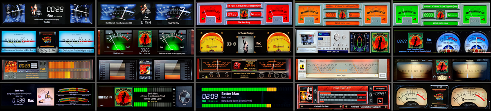
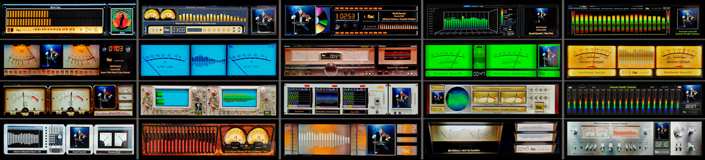
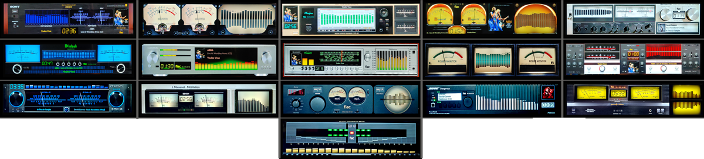

# 1480x320 Templates

All templates available for 1480x320 resolution.

---

## 1480x320_g5_501_meters

**Type:** VU Meter

**Included Meters (20):**

- 01G5_Accuphase
- 02G5_Accuphase Black
- 03G5_Advance X220
- 04G5_Rose Single Line
- 05G5_Audio Research
- 06G5_Kenwood Rev
- 07G5_Kenwood Single
- 08G5_Klanghelm
- 09G5_Klangheim Mojo
- 10G5_Krell KAS
- 11G5_Line Magnetic
- 12G5_Luxman
- 13G5_McIntosh
- 14G5_McIntosh RED
- 15G5_McIntosh Mono
- 16G5_Naim
- 17G5_Technics
- 18G5_Technics Black
- 19G5_T+A 3000HV
- 20G5_Turntable Black

**Download:** [1480x320_g5_501_meters.zip](../template_peppy/1480/320/1480x320_g5_501_meters.zip)

**Install:** Extract and copy folder to `/data/INTERNAL/peppy_screensaver/templates/`

---

## 1480x320_g5_502_meters

**Type:** VU Meter

**Included Meters (20):**

- 21G5_BlackBlur Vertical
- 22G5_BlackBlur
- 23G5_BOSS Red
- 24G5_BOSS Orange
- 25G5_BOSS green
- 26G5_Caltec
- 27G5_Dark Spotify
- 28G5_Magnetcord
- 29G5_PioneerCT LED
- 30G5_Rehringer
- 31G5_Sansui
- 32G5_Sansui Vertical
- 33G5_Sony TA-N77
- 34G5_Yamaha MX2000
- 35G5_Gemonti
- 36G5_Dorrought
- 37G5_Eversolo
- 38G5_Modern VU
- 39G5_Marantz CD
- 40G5_Brianworks

**Download:** [1480x320_g5_502_meters.zip](../template_peppy/1480/320/1480x320_g5_502_meters.zip)

**Install:** Extract and copy folder to `/data/INTERNAL/peppy_screensaver/templates/`

---

## 1480x320_g5_520_ms

**Type:** Combined

**Included Meters (20):**

- 101G5_MarschalSpectrum
- 102G5_Marschal S+M
- 103G5_CD Cover S+M
- 104G5_Nixie Spectrum
- 105G5_Kenwood Spectrum
- 106G5_Kenwood Rev S+M
- 107G5_McIntosh S+M
- 108G5_Technics S+M
- 109G5_Naim S+M
- 110G5_Deviation S+M
- 111G5_Free S+M
- 112G5_475A S+M
- 113G5_Osciloscope S+M
- 114G5_Pioneer S+M
- 115G5_Corrector Spectrum
- 116G5_RhodeSea_S+M
- 117G5_OldPipe S+M
- 118G5_VU Single S+M
- 119G5_Sony TA212 S+M
- 120G5_Akai S+M

**Download:** [1480x320_g5_520_ms.zip](../templates_peppy_spectrum/1480/320/1480x320_g5_520_ms.zip)

**Install (both required):**
1. Extract the zip file
2. Copy `templates/1480x320_g5_520_ms/` to `/data/INTERNAL/peppy_screensaver/templates/`
3. Copy `templates_spectrum/1480x320_g5_520_ms/` to `/data/INTERNAL/peppy_screensaver/templates_spectrum/`

---

## 1480x320_g5_521_ms

**Type:** Combined

**Included Meters (16):**

- 121G5_Sony_U909ES S+M
- 122G5_Ampex S+M
- 123G5_Accuphase DG68 S+M
- 124G5_Magnetocord S+M
- 125G5_Kenwood KA S+M
- 126G5_McIntosh S+M
- 127G5_CoctailAudio S+M
- 128G5_Sharp SA606 S+M
- 129G5_AudioRL S+M
- 130G5_Replika S+M
- 131G5_Emotiva S+M
- 132G5_Denon S+M
- 133G5_SPL S+M
- 134G5_Bose S+M
- 135G5_Hitachi8500 S+M
- 136G5_Sharp1000 S+M

**Download:** [1480x320_g5_521_ms.zip](../templates_peppy_spectrum/1480/320/1480x320_g5_521_ms.zip)

**Install (both required):**
1. Extract the zip file
2. Copy `templates/1480x320_g5_521_ms/` to `/data/INTERNAL/peppy_screensaver/templates/`
3. Copy `templates_spectrum/1480x320_g5_521_ms/` to `/data/INTERNAL/peppy_screensaver/templates_spectrum/`

---

