# 480 Templates

VU Meter templates for PeppyMeter Screensaver.

---

## 800x480_RB18_01

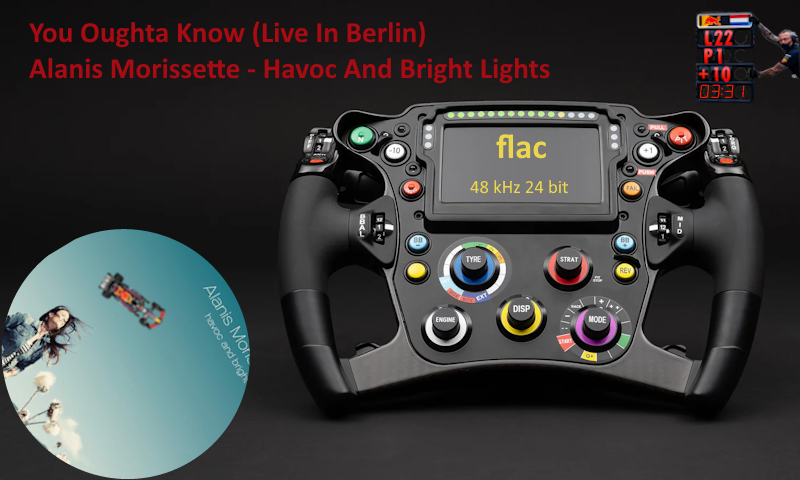

| Property | Value |
|----------|-------|
| Meter Name | Redbull |
| Meter Type | linear |
| Extended Config | Yes |
| Spectrum | No |
| Album Art | Yes |

**Download:** [800x480_RB18_01.zip](800x480_RB18_01.zip)

**Install:** Extract and copy folder to `/data/INTERNAL/peppy_screensaver/templates/`

---

## 800x480_crab_01

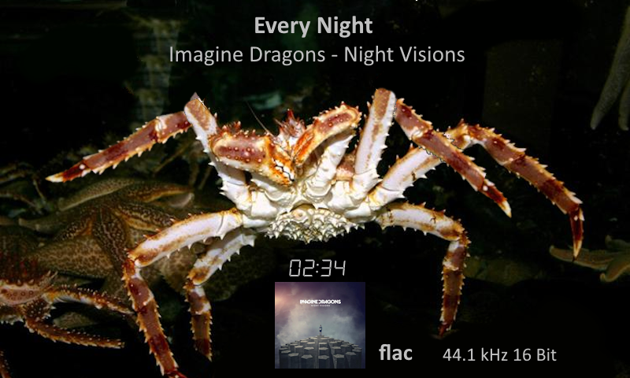

| Property | Value |
|----------|-------|
| Meter Name | crab_01 |
| Meter Type | circular |
| Extended Config | Yes |
| Spectrum | No |
| Album Art | Yes |

**Download:** [800x480_crab_01.zip](800x480_crab_01.zip)

**Install:** Extract and copy folder to `/data/INTERNAL/peppy_screensaver/templates/`

---

## 800x480_custom_01

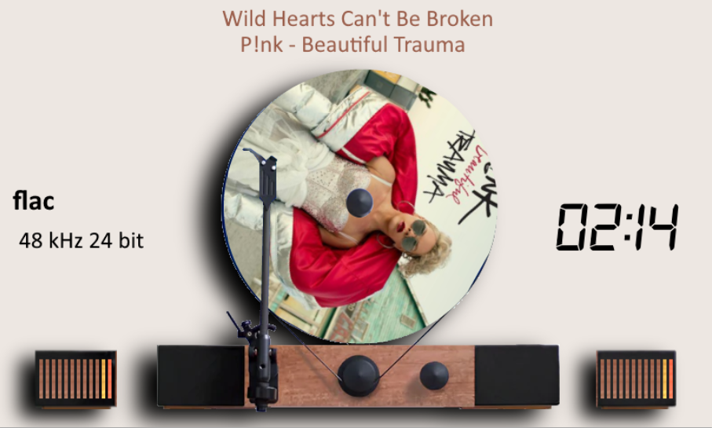

| Property | Value |
|----------|-------|
| Meter Name | vertical-turntable-blue |
| Meter Type | linear |
| Extended Config | Yes |
| Spectrum | No |
| Album Art | Yes |

**Download:** [800x480_custom_01.zip](800x480_custom_01.zip)

**Install:** Extract and copy folder to `/data/INTERNAL/peppy_screensaver/templates/`

---

## 800x480_custom_02

| Property | Value |
|----------|-------|
| Meter Name | VTEBT-RecordPlayer |
| Meter Type | linear |
| Extended Config | Yes |
| Spectrum | No |
| Album Art | Yes |

**Download:** [800x480_custom_02.zip](800x480_custom_02.zip)

**Install:** Extract and copy folder to `/data/INTERNAL/peppy_screensaver/templates/`

---

## 800x480_custom_03

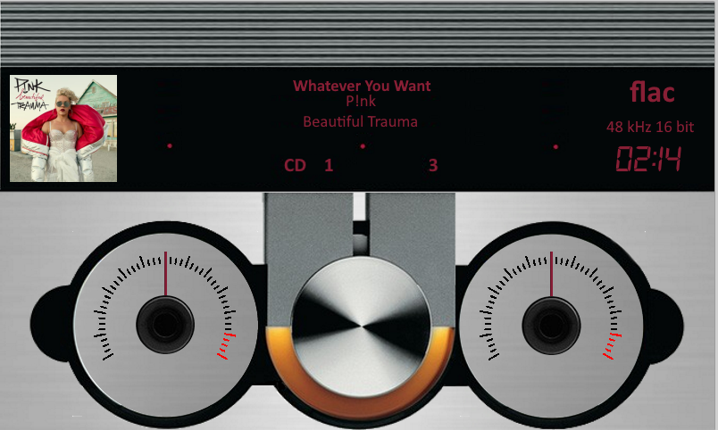

| Property | Value |
|----------|-------|
| Meter Name | Bang-Olufsen |
| Meter Type | circular |
| Extended Config | Yes |
| Spectrum | No |
| Album Art | Yes |

**Download:** [800x480_custom_03.zip](800x480_custom_03.zip)

**Install:** Extract and copy folder to `/data/INTERNAL/peppy_screensaver/templates/`

---

## 800x480_custom_04

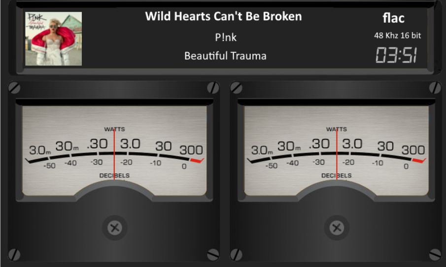

| Property | Value |
|----------|-------|
| Meter Name | black-grey-square |
| Meter Type | circular |
| Extended Config | Yes |
| Spectrum | No |
| Album Art | Yes |

**Download:** [800x480_custom_04.zip](800x480_custom_04.zip)

**Install:** Extract and copy folder to `/data/INTERNAL/peppy_screensaver/templates/`

---

## 800x480_custom_05

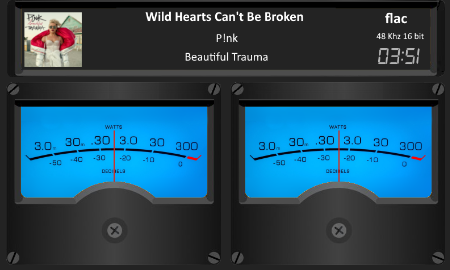

| Property | Value |
|----------|-------|
| Meter Name | black-blue-square |
| Meter Type | circular |
| Extended Config | Yes |
| Spectrum | No |
| Album Art | Yes |

**Download:** [800x480_custom_05.zip](800x480_custom_05.zip)

**Install:** Extract and copy folder to `/data/INTERNAL/peppy_screensaver/templates/`

---

## 800x480_custom_06

| Property | Value |
|----------|-------|
| Meter Name | RecordPlayer |
| Meter Type | linear |
| Extended Config | Yes |
| Spectrum | No |
| Album Art | Yes |

**Download:** [800x480_custom_06.zip](800x480_custom_06.zip)

**Install:** Extract and copy folder to `/data/INTERNAL/peppy_screensaver/templates/`

---

## 800x480_custom_07

| Property | Value |
|----------|-------|
| Meter Name | Esoteric-T1 |
| Meter Type | linear |
| Extended Config | Yes |
| Spectrum | No |
| Album Art | Yes |

**Download:** [800x480_custom_07.zip](800x480_custom_07.zip)

**Install:** Extract and copy folder to `/data/INTERNAL/peppy_screensaver/templates/`

---

## 800x480_custom_08

| Property | Value |
|----------|-------|
| Meter Name | BrystonBI200 |
| Meter Type | linear |
| Extended Config | Yes |
| Spectrum | No |
| Album Art | Yes |

**Download:** [800x480_custom_08.zip](800x480_custom_08.zip)

**Install:** Extract and copy folder to `/data/INTERNAL/peppy_screensaver/templates/`

---

## 800x480_custom_09

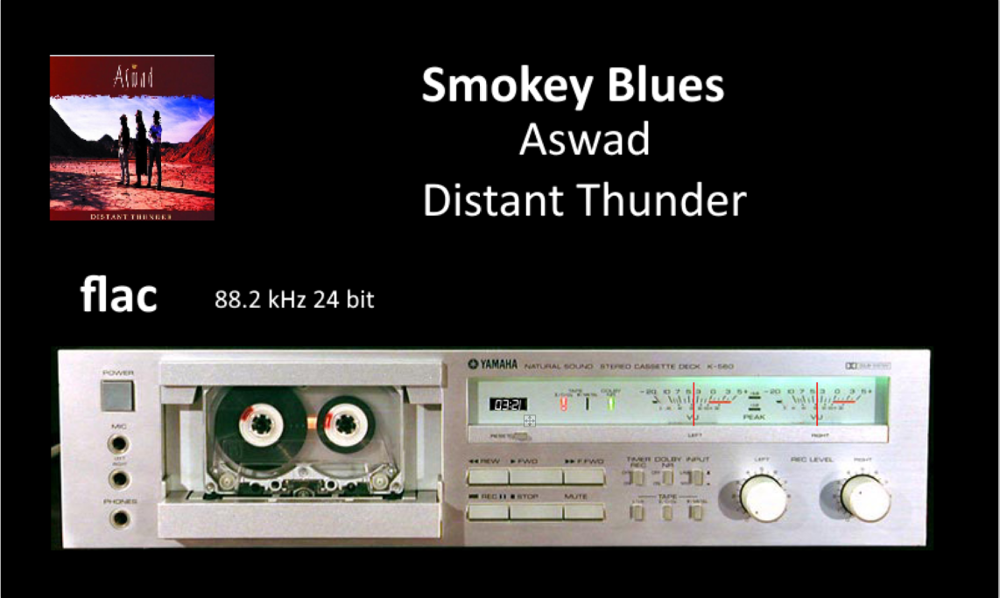

| Property | Value |
|----------|-------|
| Meter Name | cassettedeck-2 |
| Meter Type | circular |
| Extended Config | Yes |
| Spectrum | No |
| Album Art | Yes |

**Download:** [800x480_custom_09.zip](800x480_custom_09.zip)

**Install:** Extract and copy folder to `/data/INTERNAL/peppy_screensaver/templates/`

---

## 800x480_custom_10

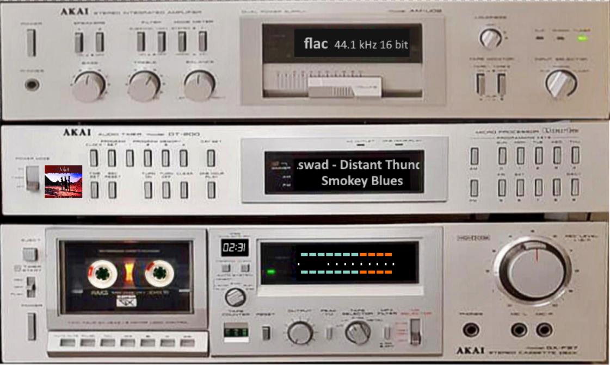

| Property | Value |
|----------|-------|
| Meter Name | cassettedeck-3 |
| Meter Type | linear |
| Extended Config | Yes |
| Spectrum | No |
| Album Art | Yes |

**Download:** [800x480_custom_10.zip](800x480_custom_10.zip)

**Install:** Extract and copy folder to `/data/INTERNAL/peppy_screensaver/templates/`

---

## 800x480_custom_13

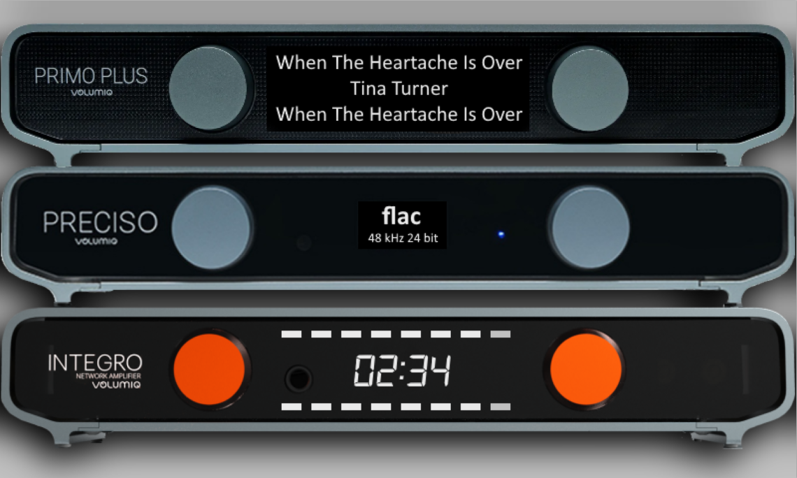

| Property | Value |
|----------|-------|
| Meter Name | Volumio |
| Meter Type | linear |
| Extended Config | Yes |
| Spectrum | No |
| Album Art | Yes |

**Download:** [800x480_custom_13.zip](800x480_custom_13.zip)

**Install:** Extract and copy folder to `/data/INTERNAL/peppy_screensaver/templates/`

---

## 800x480_custom_14

| Property | Value |
|----------|-------|
| Meter Name | BandRecorder-1 |
| Meter Type | circular |
| Extended Config | Yes |
| Spectrum | No |
| Album Art | Yes |

**Download:** [800x480_custom_14.zip](800x480_custom_14.zip)

**Install:** Extract and copy folder to `/data/INTERNAL/peppy_screensaver/templates/`

---

## 800x480_dan_dagostimo_mlife

| Property | Value |
|----------|-------|
| Meter Name | dan_dagostino_mlife |
| Meter Type | circular |
| Extended Config | Yes |
| Spectrum | No |
| Album Art | Yes |

**Download:** [800x480_dan_dagostimo_mlife.zip](800x480_dan_dagostimo_mlife.zip)

**Install:** Extract and copy folder to `/data/INTERNAL/peppy_screensaver/templates/`

---

## 800x480_dandagostino_1

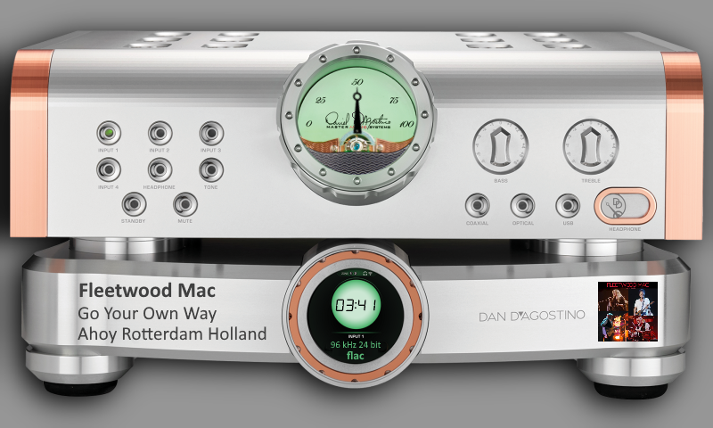

| Property | Value |
|----------|-------|
| Meter Name | dan-dagostino |
| Meter Type | circular |
| Extended Config | Yes |
| Spectrum | No |
| Album Art | Yes |

**Download:** [800x480_dandagostino_1.zip](800x480_dandagostino_1.zip)

**Install:** Extract and copy folder to `/data/INTERNAL/peppy_screensaver/templates/`

---

## 800x480_go_fishing_01

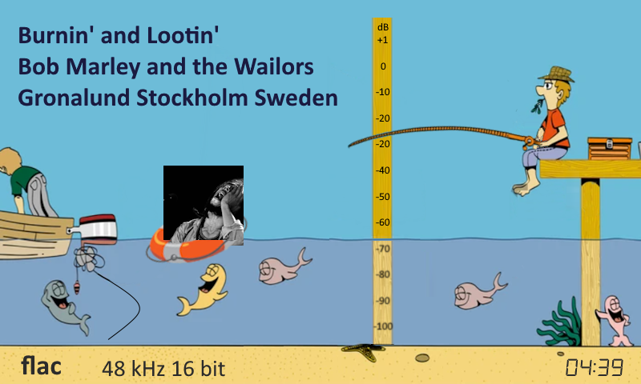

| Property | Value |
|----------|-------|
| Meter Name | go_fishing |
| Meter Type | circular |
| Extended Config | Yes |
| Spectrum | No |
| Album Art | Yes |

**Download:** [800x480_go_fishing_01.zip](800x480_go_fishing_01.zip)

**Install:** Extract and copy folder to `/data/INTERNAL/peppy_screensaver/templates/`

---

## 800x480_minions_01

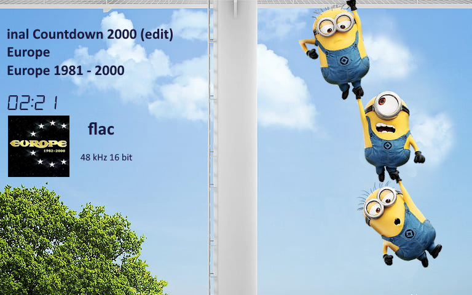

| Property | Value |
|----------|-------|
| Meter Name | minions_01 |
| Meter Type | circular |
| Extended Config | Yes |
| Spectrum | No |
| Album Art | Yes |

**Download:** [800x480_minions_01.zip](800x480_minions_01.zip)

**Install:** Extract and copy folder to `/data/INTERNAL/peppy_screensaver/templates/`

---

## 800x480_south_park

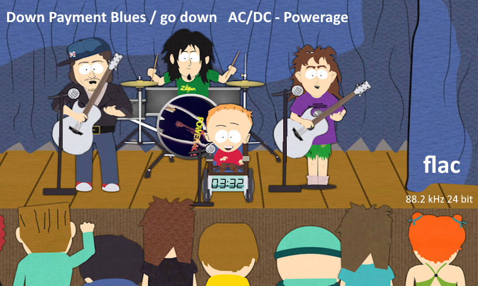

| Property | Value |
|----------|-------|
| Meter Name | southpark |
| Meter Type | circular |
| Extended Config | Yes |
| Spectrum | No |
| Album Art | Yes |

**Download:** [800x480_south_park.zip](800x480_south_park.zip)

**Install:** Extract and copy folder to `/data/INTERNAL/peppy_screensaver/templates/`

---

## 800x480_south_park_2

| Property | Value |
|----------|-------|
| Meter Name | southpark2 |
| Meter Type | circular |
| Extended Config | Yes |
| Spectrum | No |
| Album Art | Yes |

**Download:** [800x480_south_park_2.zip](800x480_south_park_2.zip)

**Install:** Extract and copy folder to `/data/INTERNAL/peppy_screensaver/templates/`

---

## Installation

1. Download the desired template zip(s)
2. Extract each to the path shown next to its download link
3. Select in plugin settings

---

*Part of [PeppyMeter Templates](https://github.com/foonerd/peppy_templates)*
