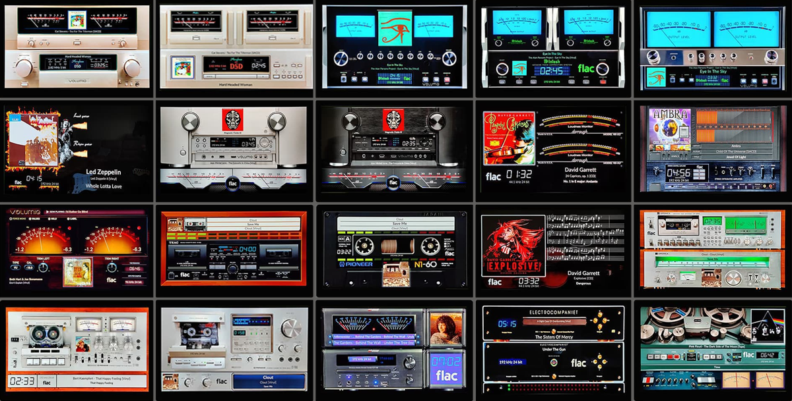

# 600 Templates

VU Meter templates for PeppyMeter Screensaver.

---

## 1024x600_g5_111_meters

| Property | Value |
|----------|-------|
| Template Pack | Yes (20 templates) |
| Meter Type | circular |
| Extended Config | Yes |
| Spectrum | No |
| Album Art | Yes |

**Included Meters:**

- 01G5_Accuphase
- 02G5_Accuphase monoblock
- 03G5_McIntosh Hybrid
- 04G5_McIntosh
- 05G5_McIntosh monoblock
- 06G5_Fire Rock
- 07G5_Marantz Silver
- 08G5_Marantz Black
- 09G5_Dorrough
- 10G5_Sansui
- 11G5_Klanghelm
- 12G5_Teac Cassette
- 13G5_Full Cassette
- 14G5_Violin
- 15G5_Optonica
- 16G5_Pioneer Deck
- 17G5_PioneerCT
- 18G5_Advence
- 19G5_Abrahamsen
- 20G5_J37 Tape

**Download:** [1024x600_g5_111_meters.zip](1024x600_g5_111_meters.zip)

**Install:** Extract and copy folder to `/data/INTERNAL/peppy_screensaver/templates/`

---

## Installation

1. Download the desired template zip(s)
2. Extract each to the path shown next to its download link
3. Select in plugin settings

---

*Part of [PeppyMeter Templates](https://github.com/foonerd/peppy_templates)*
