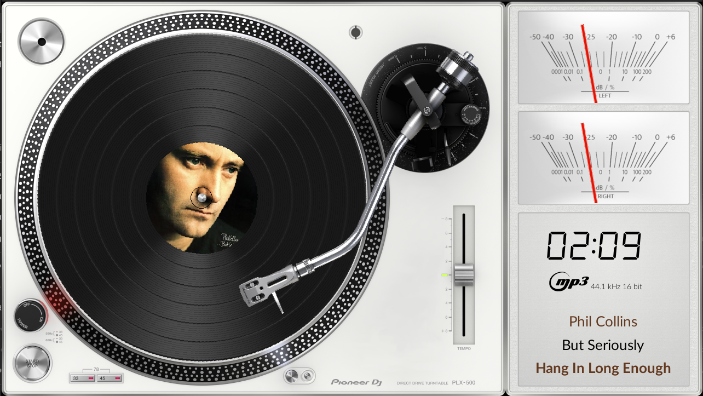
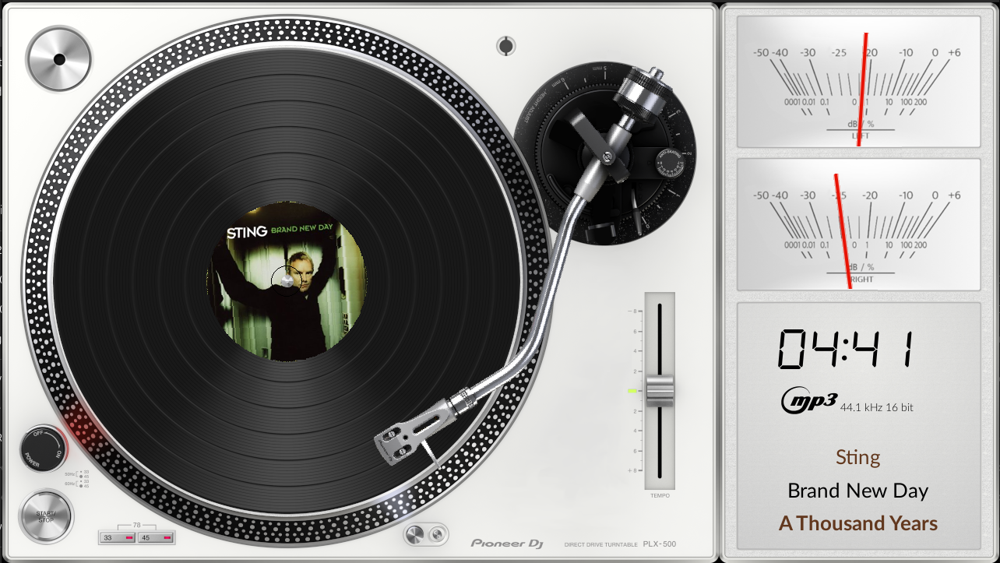

# 720 Templates

VU Meter templates for PeppyMeter Screensaver.

---

## 1280x720_PMN_LedStrypes

| Property | Value |
|----------|-------|
| Template Pack | Yes (5 templates) |
| Meter Type | linear |
| Extended Config | Yes |
| Spectrum | No |
| Album Art | Yes |

**Included Meters:**

- 01PMN_Led Strypes (With Meters-Calibrated)
- 02PMN_Led Strypes (With Meters-Calibrated-Metadata Rotation) v1
- 03PMN_Led Strypes (With Meters-Calibrated-Metadata Rotation) v2
- 04PMN_Led Strypes (With Meters-Calibrated-Metadata) v1
- 05PMN_Led Strypes (With Meters-Calibrated-Metadata) v2

**Download:** [1280x720_PMN_LedStrypes.zip](1280x720_PMN_LedStrypes.zip)

**Install:** Extract and copy folder to `/data/INTERNAL/peppy_screensaver/templates/`

---

## 1280x720_Pioneer_PLX-500

| Property | Value |
|----------|-------|
| Meter Name | Pioneer PLX-500 |
| Meter Type | circular |
| Extended Config | Yes |
| Spectrum | No |
| Album Art | Yes |

**Download:** [1280x720_Pioneer_PLX-500.zip](1280x720_Pioneer_PLX-500.zip)

**Install:** Extract and copy folder to `/data/INTERNAL/peppy_screensaver/templates/`

---

## 1280x720_Pioneer_PLX-500L

| Property | Value |
|----------|-------|
| Meter Name | Pioneer PLX-500 Lite |
| Meter Type | circular |
| Extended Config | Yes |
| Spectrum | No |
| Album Art | Yes |

**Download:** [1280x720_Pioneer_PLX-500L.zip](1280x720_Pioneer_PLX-500L.zip)

**Install:** Extract and copy folder to `/data/INTERNAL/peppy_screensaver/templates/`

---

## 1280x720_custom_01

| Property | Value |
|----------|-------|
| Meter Name | vertical-turntable-blue |
| Meter Type | linear |
| Extended Config | Yes |
| Spectrum | No |
| Album Art | Yes |

**Download:** [1280x720_custom_01.zip](1280x720_custom_01.zip)

**Install:** Extract and copy folder to `/data/INTERNAL/peppy_screensaver/templates/`

---

## 1280x720_custom_02

| Property | Value |
|----------|-------|
| Meter Name | VTEBT-RecordPlayer |
| Meter Type | linear |
| Extended Config | Yes |
| Spectrum | No |
| Album Art | Yes |

**Download:** [1280x720_custom_02.zip](1280x720_custom_02.zip)

**Install:** Extract and copy folder to `/data/INTERNAL/peppy_screensaver/templates/`

---

## 1280x720_custom_06

| Property | Value |
|----------|-------|
| Meter Name | RecordPlayer |
| Meter Type | linear |
| Extended Config | Yes |
| Spectrum | No |
| Album Art | Yes |

**Download:** [1280x720_custom_06.zip](1280x720_custom_06.zip)

**Install:** Extract and copy folder to `/data/INTERNAL/peppy_screensaver/templates/`

---

## 1280x720_g5_440_meters

| Property | Value |
|----------|-------|
| Template Pack | Yes (4 templates) |
| Meter Type | linear |
| Extended Config | Yes |
| Spectrum | No |
| Album Art | Yes |

**Included Meters:**

- 01G5_Tascam Reel
- 02G5_McIntosh Hybrid
- 03G5_TDK Reel
- 04G5_Free

**Download:** [1280x720_g5_440_meters.zip](1280x720_g5_440_meters.zip)

**Install:** Extract and copy folder to `/data/INTERNAL/peppy_screensaver/templates/`

---

## 1280x720_g5_441_meters

| Property | Value |
|----------|-------|
| Template Pack | Yes (6 templates) |
| Meter Type | circular |
| Extended Config | Yes |
| Spectrum | No |
| Album Art | Yes |

**Included Meters:**

- 05G5_Hitachi HMA7500 Black
- 06G5_Klanghelm
- 07G5_Technisc_Black
- 08G5_Akai Reverse
- 09G5_Sansui
- 10G5_Casette Full

**Download:** [1280x720_g5_441_meters.zip](1280x720_g5_441_meters.zip)

**Install:** Extract and copy folder to `/data/INTERNAL/peppy_screensaver/templates/`

---

## 1280x720_g5_442_meters

| Property | Value |
|----------|-------|
| Template Pack | Yes (6 templates) |
| Meter Type | circular |
| Extended Config | Yes |
| Spectrum | No |
| Album Art | Yes |

**Included Meters:**

- 11G5_Kenwood Rev
- 12G5_T+A
- 13G5_Accuphase monoblock
- 14G5_Old2 braun
- 15G5_Hartman
- 16G5_Rehringer

**Download:** [1280x720_g5_442_meters.zip](1280x720_g5_442_meters.zip)

**Install:** Extract and copy folder to `/data/INTERNAL/peppy_screensaver/templates/`

---

## 1280x720_g5_443_rotate

| Property | Value |
|----------|-------|
| Meter Name | 17G5_TURN Vinyl Black |
| Meter Type | circular |
| Extended Config | Yes |
| Spectrum | No |
| Album Art | Yes |

**Download:** [1280x720_g5_443_rotate.zip](1280x720_g5_443_rotate.zip)

**Install:** Extract and copy folder to `/data/INTERNAL/peppy_screensaver/templates/`

---

## 1280x720_g5_444_rotate

| Property | Value |
|----------|-------|
| Meter Name | 18G5_Streamer CD |
| Meter Type | circular |
| Extended Config | Yes |
| Spectrum | No |
| Album Art | Yes |

**Download:** [1280x720_g5_444_rotate.zip](1280x720_g5_444_rotate.zip)

**Install:** Extract and copy folder to `/data/INTERNAL/peppy_screensaver/templates/`

---

## 1280x720_g5_445_rotate

| Property | Value |
|----------|-------|
| Template Pack | Yes (2 templates) |
| Meter Type | circular |
| Extended Config | Yes |
| Spectrum | No |
| Album Art | Yes |

**Included Meters:**

- 19G5_Cassette_Circular
- 20G5_Cassette_Linear

**Download:** [1280x720_g5_445_rotate.zip](1280x720_g5_445_rotate.zip)

**Install:** Extract and copy folder to `/data/INTERNAL/peppy_screensaver/templates/`

---

## Installation

1. Download the desired template zip(s)
2. Extract each to the path shown next to its download link
3. Select in plugin settings

---

*Part of [PeppyMeter Templates](https://github.com/foonerd/peppy_templates)*
