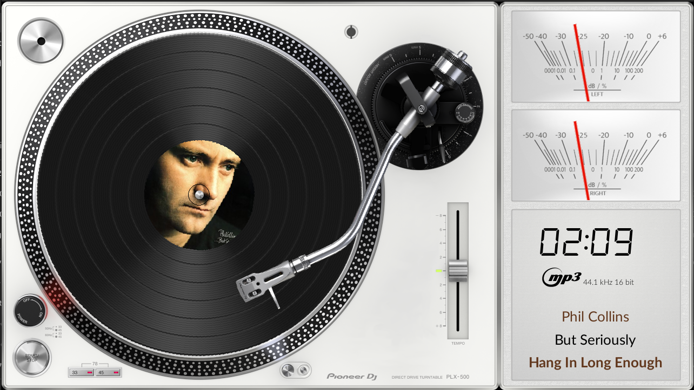
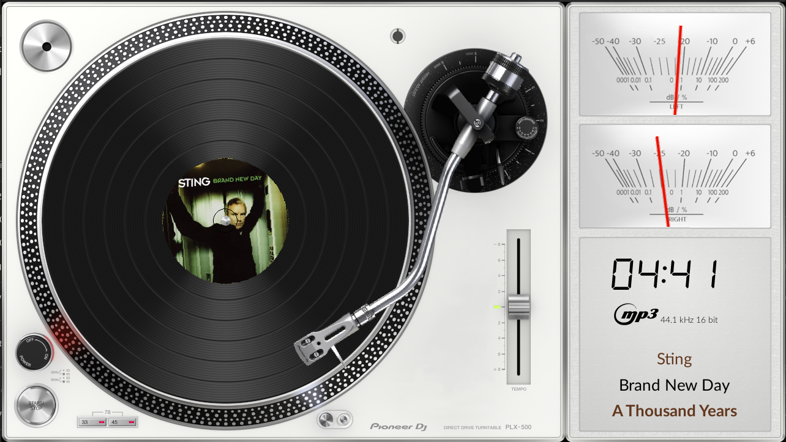
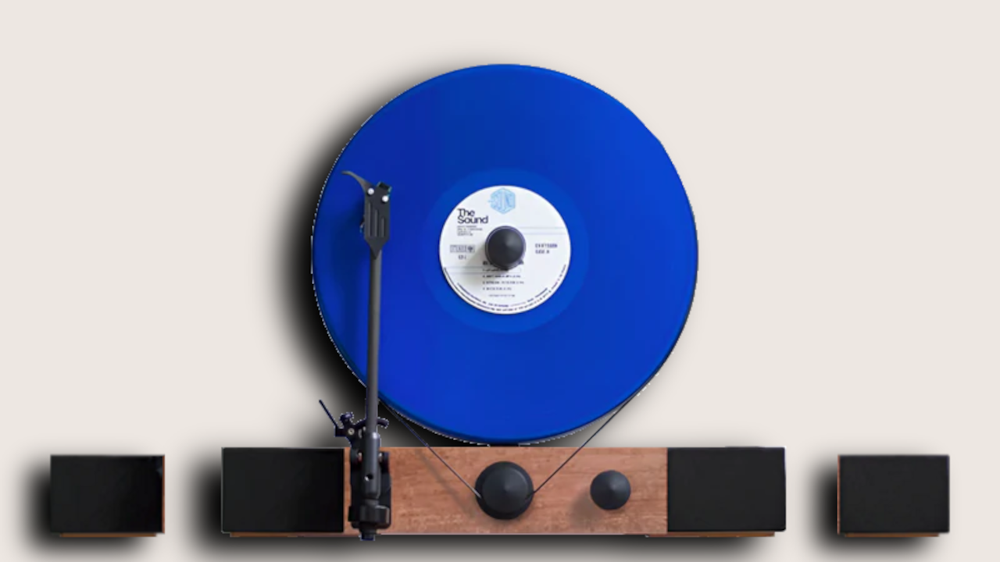
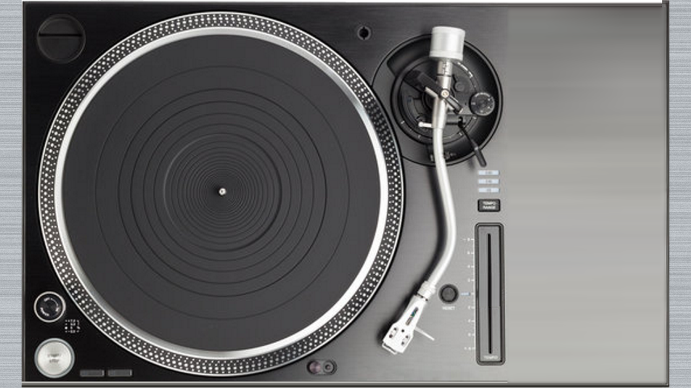
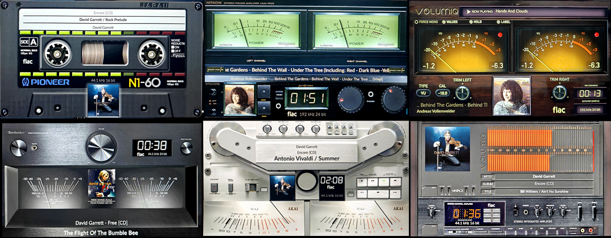
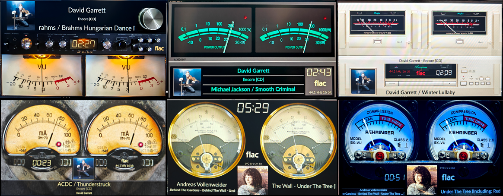
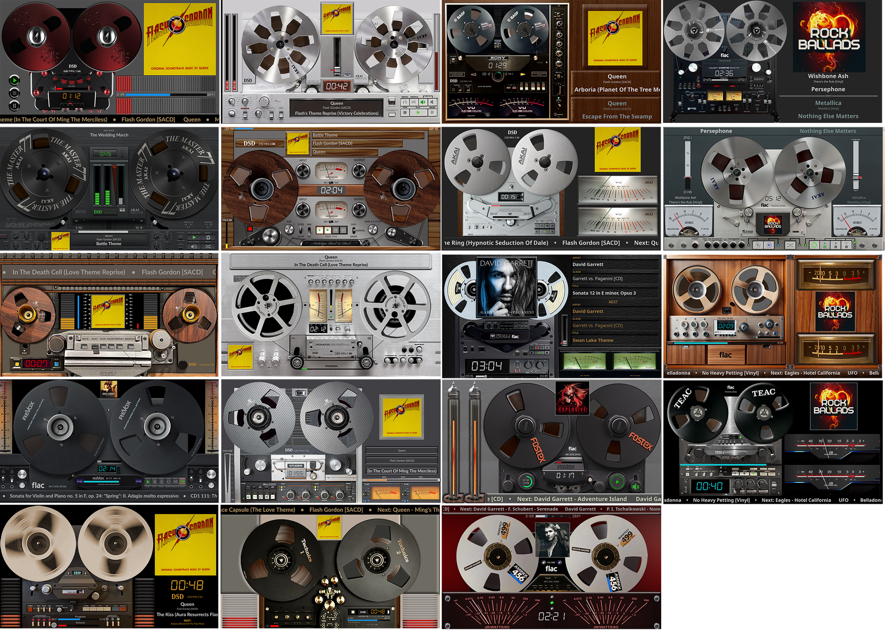
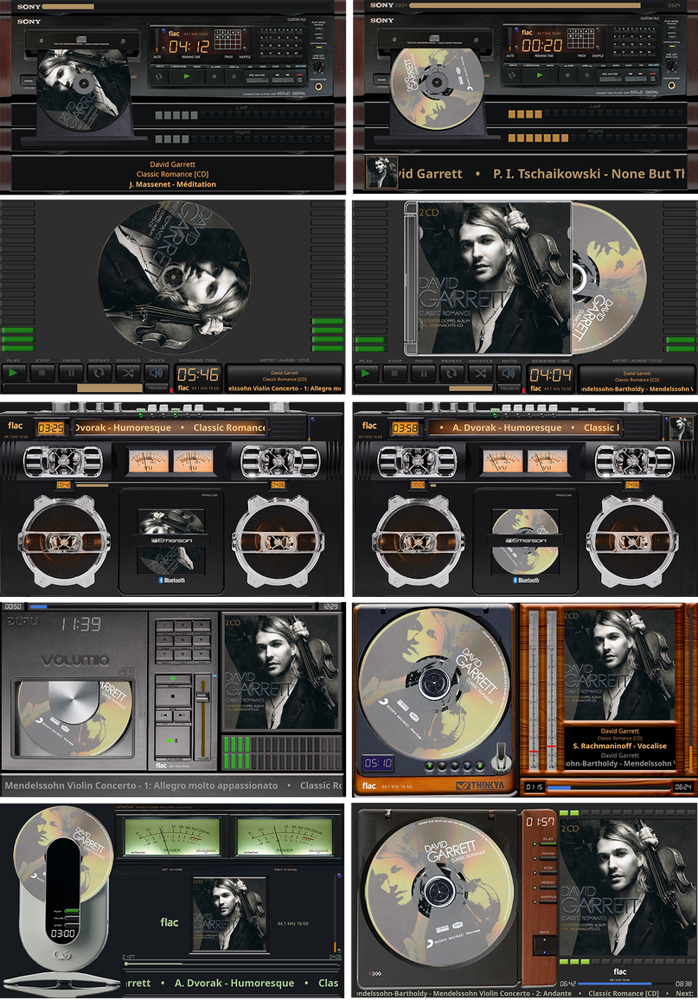

# 720 Templates

VU Meter templates for PeppyMeter Screensaver.

---

## 1280x720_PMN_LedStrypes

| Property | Value |
|----------|-------|
| Template Pack | Yes (5 templates) |
| Meter Type | linear |
| Extended Config | Yes |
| Spectrum | No |
| Album Art | Yes |

**Included Meters:**

- 01PMN_Led Strypes (With Meters-Calibrated)
- 02PMN_Led Strypes (With Meters-Calibrated-Metadata Rotation) v1
- 03PMN_Led Strypes (With Meters-Calibrated-Metadata Rotation) v2
- 04PMN_Led Strypes (With Meters-Calibrated-Metadata) v1
- 05PMN_Led Strypes (With Meters-Calibrated-Metadata) v2

**Download:** [1280x720_PMN_LedStrypes.zip](1280x720_PMN_LedStrypes.zip)

**Install:** Extract and copy folder to `/data/INTERNAL/peppy_screensaver/templates/`

---

## 1280x720_Pioneer_PLX-500

| Property | Value |
|----------|-------|
| Meter Name | Pioneer PLX-500 |
| Meter Type | circular |
| Extended Config | Yes |
| Spectrum | No |
| Album Art | Yes |

**Download:** [1280x720_Pioneer_PLX-500.zip](1280x720_Pioneer_PLX-500.zip)

**Install:** Extract and copy folder to `/data/INTERNAL/peppy_screensaver/templates/`

---

## 1280x720_Pioneer_PLX-500L

| Property | Value |
|----------|-------|
| Meter Name | Pioneer PLX-500 Lite |
| Meter Type | circular |
| Extended Config | Yes |
| Spectrum | No |
| Album Art | Yes |

**Download:** [1280x720_Pioneer_PLX-500L.zip](1280x720_Pioneer_PLX-500L.zip)

**Install:** Extract and copy folder to `/data/INTERNAL/peppy_screensaver/templates/`

---

## 1280x720_custom_01

| Property | Value |
|----------|-------|
| Meter Name | vertical-turntable-blue |
| Meter Type | linear |
| Extended Config | Yes |
| Spectrum | No |
| Album Art | Yes |

**Download:** [1280x720_custom_01.zip](1280x720_custom_01.zip)

**Install:** Extract and copy folder to `/data/INTERNAL/peppy_screensaver/templates/`

---

## 1280x720_custom_02

| Property | Value |
|----------|-------|
| Meter Name | VTEBT-RecordPlayer |
| Meter Type | linear |
| Extended Config | Yes |
| Spectrum | No |
| Album Art | Yes |

**Download:** [1280x720_custom_02.zip](1280x720_custom_02.zip)

**Install:** Extract and copy folder to `/data/INTERNAL/peppy_screensaver/templates/`

---

## 1280x720_custom_06

| Property | Value |
|----------|-------|
| Meter Name | RecordPlayer |
| Meter Type | linear |
| Extended Config | Yes |
| Spectrum | No |
| Album Art | Yes |

**Download:** [1280x720_custom_06.zip](1280x720_custom_06.zip)

**Install:** Extract and copy folder to `/data/INTERNAL/peppy_screensaver/templates/`

---

## 1280x720_g5_440_meters

| Property | Value |
|----------|-------|
| Template Pack | Yes (4 templates) |
| Meter Type | linear |
| Extended Config | Yes |
| Spectrum | No |
| Album Art | Yes |

**Included Meters:**

- 01G5_Tascam Reel
- 02G5_McIntosh Hybrid
- 03G5_TDK Reel
- 04G5_Free

**Download:** [1280x720_g5_440_meters.zip](1280x720_g5_440_meters.zip)

**Install:** Extract and copy folder to `/data/INTERNAL/peppy_screensaver/templates/`

---

## 1280x720_g5_441_meters

| Property | Value |
|----------|-------|
| Template Pack | Yes (6 templates) |
| Meter Type | circular |
| Extended Config | Yes |
| Spectrum | No |
| Album Art | Yes |

**Included Meters:**

- 05G5_Hitachi HMA7500 Black
- 06G5_Klanghelm
- 07G5_Technisc_Black
- 08G5_Akai Reverse
- 09G5_Sansui
- 10G5_Casette Full

**Download:** [1280x720_g5_441_meters.zip](1280x720_g5_441_meters.zip)

**Install:** Extract and copy folder to `/data/INTERNAL/peppy_screensaver/templates/`

---

## 1280x720_g5_442_meters

| Property | Value |
|----------|-------|
| Template Pack | Yes (6 templates) |
| Meter Type | circular |
| Extended Config | Yes |
| Spectrum | No |
| Album Art | Yes |

**Included Meters:**

- 11G5_Kenwood Rev
- 12G5_T+A
- 13G5_Accuphase monoblock
- 14G5_Old2 braun
- 15G5_Hartman
- 16G5_Rehringer

**Download:** [1280x720_g5_442_meters.zip](1280x720_g5_442_meters.zip)

**Install:** Extract and copy folder to `/data/INTERNAL/peppy_screensaver/templates/`

---

## 1280x720_g5_444_rotate

| Property | Value |
|----------|-------|
| Meter Name | 18G5_Streamer CD |
| Meter Type | circular |
| Extended Config | Yes |
| Spectrum | No |
| Album Art | Yes |

**Download:** [1280x720_g5_444_rotate.zip](1280x720_g5_444_rotate.zip)

**Install:** Extract and copy folder to `/data/INTERNAL/peppy_screensaver/templates/`

---

## 1280x720_g5_710_Turntables

| Property | Value |
|----------|-------|
| Template Pack | Yes (30 templates) |
| Meter Type | linear |
| Extended Config | Yes |
| Spectrum | No |
| Album Art | Yes |

**Included Meters:**

- 141G5_01_Vertere Turn
- 141G5_02_Vertere Turn
- 141G5_03_Vertere Turn
- 142G5_01_Pioneer Gold
- 142G5_02_Pioneer Gold
- 142G5_03_Pioneer Gold
- 143G5_TURN Vinyl Black
- 144G5_01_Naim Turntable
- 144G5_02_Naim Turntable
- 144G5_03_Naim Turntable
- 145G5_01_McIntosh MTI100
- 145G5_02_McIntosh MTI100
- 145G5_03_McIntosh MTI100
- 146G5_01_Denon DP62
- 146G5_02_Denon DP62
- 146G5_03_Denon DP62
- 147G5_01_Denon DP400
- 147G5_02_Denon DP400
- 147G5_03_Denon DP400
- 148G5_01_Reloop RL7000
- 148G5_02_Reloop RL7000
- 148G5_03_Reloop RL7000
- 149G5_01_Thorens
- 149G5_02_Thorens
- 149G5_03_Thorens
- 150G5_02_AMG Turntable
- 150G5_03_AMG Turntable
- 151G5_01_Technics Silver
- 151G5_02_Technics Silver
- 151G5_03_Technics Silver

**Download:** [1280x720_g5_710_Turntables.zip](1280x720_g5_710_Turntables.zip)

**Install:** Extract and copy folder to `/data/INTERNAL/peppy_screensaver/templates/`

---

## 1280x720_g5_711_Tape_Recorder

| Property | Value |
|----------|-------|
| Template Pack | Yes (10 templates) |
| Meter Type | linear |
| Extended Config | Yes |
| Spectrum | No |
| Album Art | Yes |

**Included Meters:**

- 151G5_Akai77 black
- 152G5_Akai77_silver
- 153G5_Studer A810
- 154G5_PioneerRT707_silver
- 155G5_Antelope Reel
- 156G5_Otari Reel
- 157G5_Revox B77
- 158G5_Tascam Rec
- 159G5_Technics Rec
- 160G5_Metaxas Rec

**Download:** [1280x720_g5_711_Tape_Recorder.zip](1280x720_g5_711_Tape_Recorder.zip)

**Install:** Extract and copy folder to `/data/INTERNAL/peppy_screensaver/templates/`

---

## 1280x720_g5_712_Cassette

| Property | Value |
|----------|-------|
| Template Pack | Yes (10 templates) |
| Meter Type | linear |
| Extended Config | Yes |
| Spectrum | No |
| Album Art | Yes |

**Included Meters:**

- 161G5_Pioneer Cassette
- 162G5_TDK cassette
- 163G5_TEAC cassette
- 164G5_Maxell Cassette
- 165G5_BASF Free
- 166G5_Cassette_Circular
- 167G5_Cassette_Linear
- 168G5_Philips Cassette
- 169G5_Denon DR650
- 170G5_SonyK770 cassette

**Download:** [1280x720_g5_712_Cassette.zip](1280x720_g5_712_Cassette.zip)

**Install:** Extract and copy folder to `/data/INTERNAL/peppy_screensaver/templates/`

---

## 1280x720_g5_713_CD

| Property | Value |
|----------|-------|
| Template Pack | Yes (4 templates) |
| Meter Type | linear |
| Extended Config | Yes |
| Spectrum | No |
| Album Art | Yes |

**Included Meters:**

- 171G5_Sony557 Full
- 172G5_Sony557 Cust
- 173G5_CD Player Full
- 174G5_CD Player Cust

**Download:** [1280x720_g5_713_CD.zip](1280x720_g5_713_CD.zip)

**Install:** Extract and copy folder to `/data/INTERNAL/peppy_screensaver/templates/`

---

## Installation

1. Download the desired template zip(s)
2. Extract each to the path shown next to its download link
3. Select in plugin settings

---

*Part of [PeppyMeter Templates](https://github.com/foonerd/peppy_templates)*
