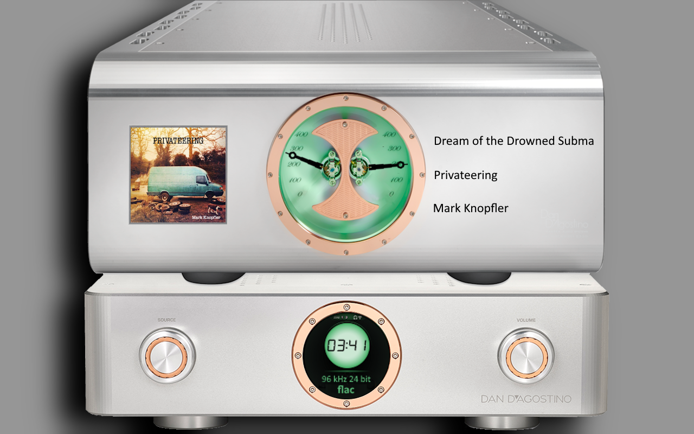
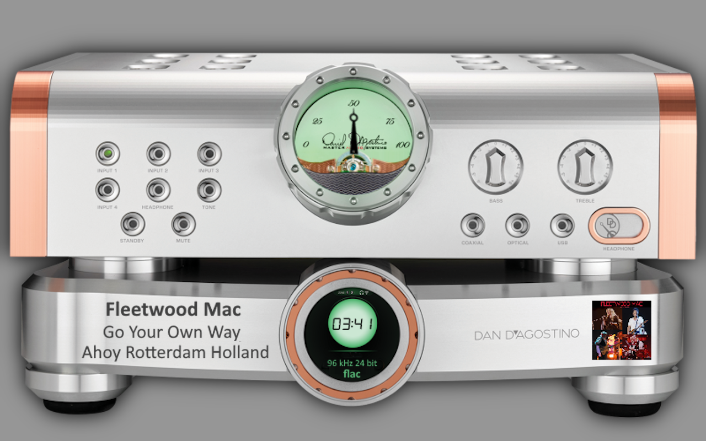
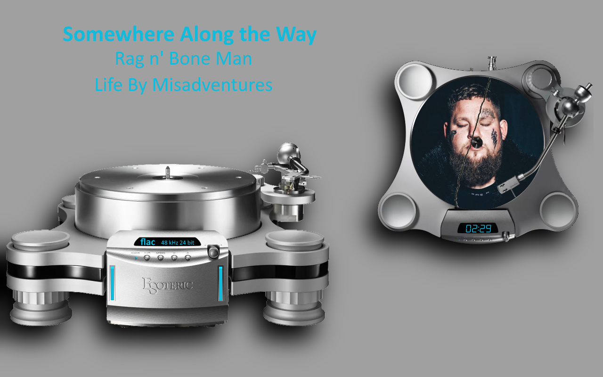
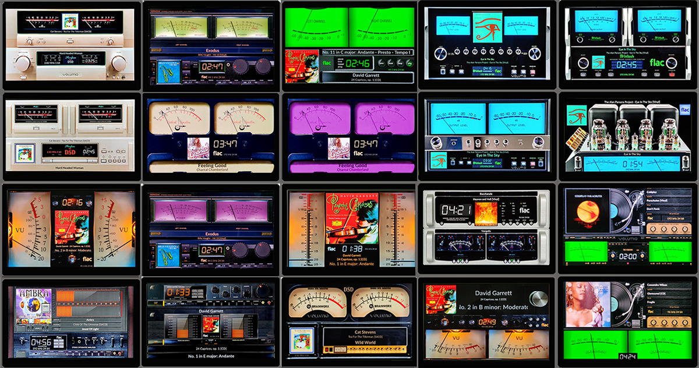
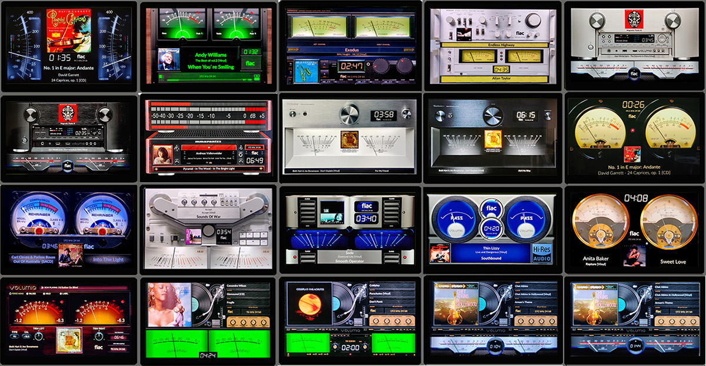
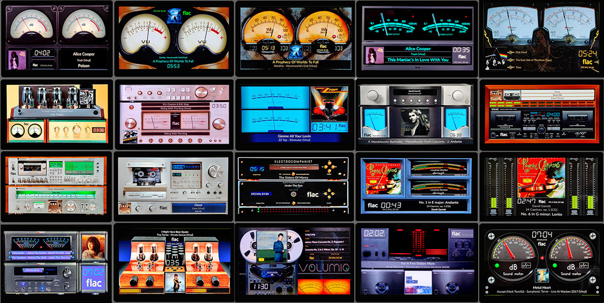
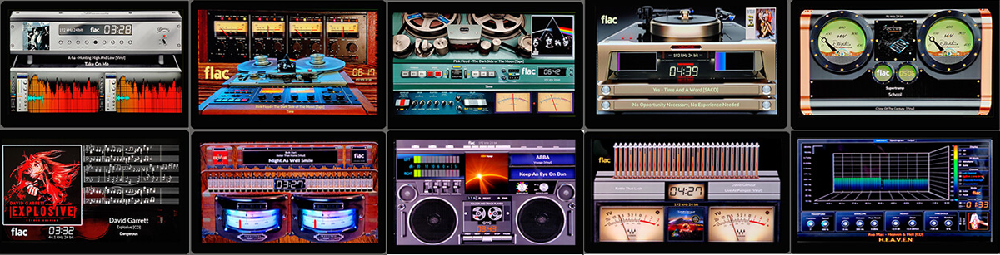
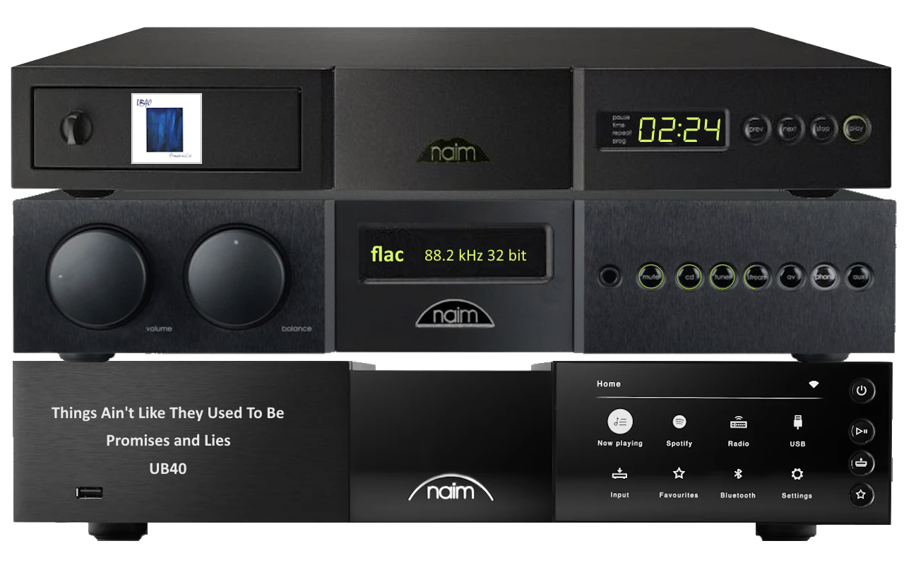
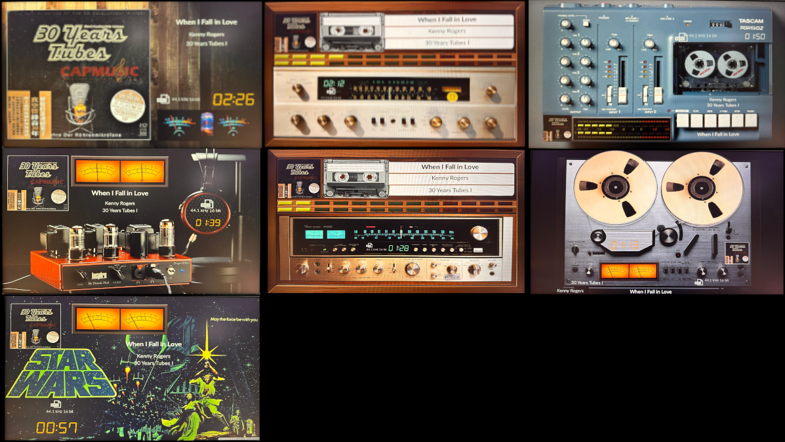
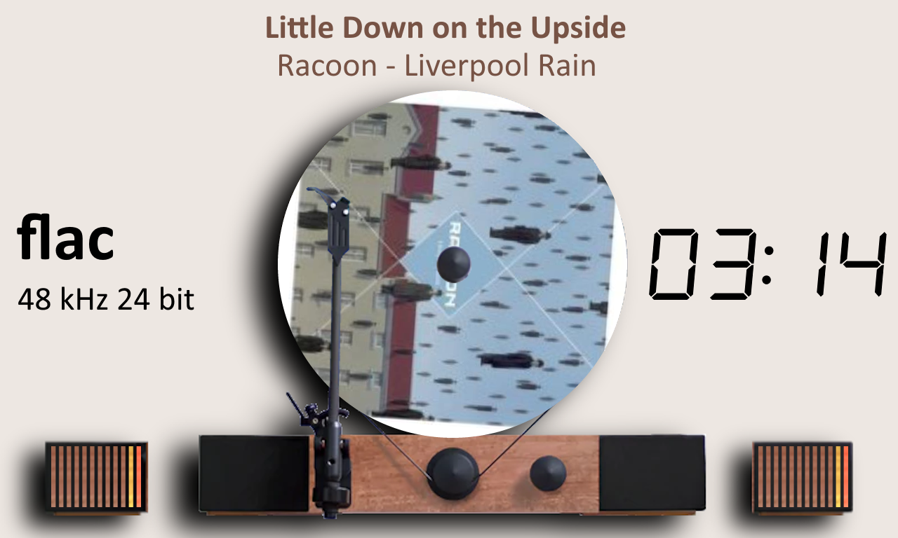

# 800 Templates

VU Meter templates for PeppyMeter Screensaver.

---

## 1280x800_dagostino_pendulum

| Property | Value |
|----------|-------|
| Meter Name | dan_dagostimo_mlife |
| Meter Type | circular |
| Extended Config | Yes |
| Spectrum | No |
| Album Art | Yes |

**Download:** [1280x800_dagostino_pendulum.zip](1280x800_dagostino_pendulum.zip)

**Install:** Extract and copy folder to `/data/INTERNAL/peppy_screensaver/templates/`

---

## 1280x800_dan_dagostimo_momentum_c2

| Property | Value |
|----------|-------|
| Meter Name | dan-dagostino |
| Meter Type | circular |
| Extended Config | Yes |
| Spectrum | No |
| Album Art | Yes |

**Download:** [1280x800_dan_dagostimo_momentum_c2.zip](1280x800_dan_dagostimo_momentum_c2.zip)

**Install:** Extract and copy folder to `/data/INTERNAL/peppy_screensaver/templates/`

---

## 1280x800_esoteric-grandioso-t1

| Property | Value |
|----------|-------|
| Meter Name | esoteric-grandioso-t1 |
| Meter Type | linear |
| Extended Config | Yes |
| Spectrum | No |
| Album Art | Yes |

**Download:** [1280x800_esoteric-grandioso-t1.zip](1280x800_esoteric-grandioso-t1.zip)

**Install:** Extract and copy folder to `/data/INTERNAL/peppy_screensaver/templates/`

---

## 1280x800_g5_420_meters

| Property | Value |
|----------|-------|
| Template Pack | Yes (20 templates) |
| Meter Type | circular |
| Extended Config | Yes |
| Spectrum | No |
| Album Art | Yes |

**Included Meters:**

- 01G5_Accuphase
- 02G5_Accuphase monoblock
- 03G5_Berlant
- 04G5_Berlant Purple
- 05G5_Audio Research
- 06G5_McIntosh
- 07G5_McIntosh monoblock
- 08G5_McIntosh Hybrid
- 09G5_McIntosh Tube
- 10G5_Kenwood Ver
- 11G5_Kenwood Rev
- 12G5_VU Single Yellow
- 13G5_NAD C3050 Purple
- 14G5_NAD C3050
- 15G5_Naim green
- 16G5_Naim 2
- 17G5_Naim Rev
- 18G5_Sansui
- 19G5_Sansui 2V
- 20G5_Brianworks

**Download:** [1280x800_g5_420_meters.zip](1280x800_g5_420_meters.zip)

**Install:** Extract and copy folder to `/data/INTERNAL/peppy_screensaver/templates/`

---

## 1280x800_g5_421_meters

| Property | Value |
|----------|-------|
| Template Pack | Yes (20 templates) |
| Meter Type | circular |
| Extended Config | Yes |
| Spectrum | No |
| Album Art | Yes |

**Included Meters:**

- 21G5_BlackBlur
- 22G5_Dark Spotify
- 23G5_Hitachi HMA7500 Black
- 24G5_Hitachi HCA7500 Silver
- 25G5_Marantz Silver
- 26G5_Marantz Black
- 27G5_MarantzCD
- 28G5_Technisc_Black
- 29G5_Technisc_Silver
- 30G5_Round yellow
- 31G5_Rehringer
- 32G5_Akai Reverse
- 33G5_ClasseM
- 34G5_BMC
- 35G5_Hartman
- 36G5_Klanghelm
- 37G5_TURN Vinyl Green
- 38G5_TURN Vinyl Green 2
- 39G5_TURN Vinyl Silver
- 40G5_TURN Vinyl Black

**Download:** [1280x800_g5_421_meters.zip](1280x800_g5_421_meters.zip)

**Install:** Extract and copy folder to `/data/INTERNAL/peppy_screensaver/templates/`

---

## 1280x800_g5_422_meters

| Property | Value |
|----------|-------|
| Template Pack | Yes (20 templates) |
| Meter Type | circular |
| Extended Config | Yes |
| Spectrum | No |
| Album Art | Yes |

**Included Meters:**

- 41G5_Yellowkidney
- 42G5_OLD Meter
- 43G5_Old2 braun
- 44G5_T+A
- 45G5_Triplett
- 46G5_Leben
- 47G5_Luxman Gold
- 48G5_Vertical blue
- 49G5_MarkLev
- 50G5_Teac Cassette
- 51G5_Optonica
- 52G5_PioneerCT
- 53G5_Abrahamsen
- 54G5_Dorrough
- 55G5_Dorrough Vertical
- 56G5_Advence
- 57G5_Unison Research
- 58G5_TAPE orange
- 59G5_Yamaha M85
- 60G5_Sound90

**Download:** [1280x800_g5_422_meters.zip](1280x800_g5_422_meters.zip)

**Install:** Extract and copy folder to `/data/INTERNAL/peppy_screensaver/templates/`

---

## 1280x800_g5_423_meters

| Property | Value |
|----------|-------|
| Template Pack | Yes (10 templates) |
| Meter Type | linear |
| Extended Config | Yes |
| Spectrum | No |
| Album Art | Yes |

**Included Meters:**

- 61G5_Burmaster
- 62G5_Violin
- 63G5_Struder
- 64G5_J37 Tape
- 65G5_HelixOne
- 66G5_DAgostini
- 67G5_Reher Tube
- 68G5_Boombox
- 69G5_Nixi Pipe
- 70G5_Nixi Spectrum

**Download:** [1280x800_g5_423_meters.zip](1280x800_g5_423_meters.zip)

**Install:** Extract and copy folder to `/data/INTERNAL/peppy_screensaver/templates/`

---

## 1280x800_naim_set

| Property | Value |
|----------|-------|
| Meter Name | Naim_Set |
| Meter Type | linear |
| Extended Config | Yes |
| Spectrum | No |
| Album Art | Yes |

**Download:** [1280x800_naim_set.zip](1280x800_naim_set.zip)

**Install:** Extract and copy folder to `/data/INTERNAL/peppy_screensaver/templates/`

---

## 1280x800_t1800_pack7

| Property | Value |
|----------|-------|
| Template Pack | Yes (7 templates) |
| Meter Type | circular |
| Extended Config | Yes |
| Spectrum | No |
| Album Art | Yes |

**Included Meters:**

- t1800_tubes
- t1800_Fisher
- t1800_Tascam
- t1800_TubeHeadPhone
- t1800_Sansui9090
- t1800_ReelTape
- t1800_StarWars

**Download:** [1280x800_t1800_pack7.zip](1280x800_t1800_pack7.zip)

**Install:** Extract and copy folder to `/data/INTERNAL/peppy_screensaver/templates/`

---

## 1280x800_vertical_blue

| Property | Value |
|----------|-------|
| Meter Name | vertical-turntable-blue |
| Meter Type | linear |
| Extended Config | Yes |
| Spectrum | No |
| Album Art | Yes |

**Download:** [1280x800_vertical_blue.zip](1280x800_vertical_blue.zip)

**Install:** Extract and copy folder to `/data/INTERNAL/peppy_screensaver/templates/`

---

## 1280x800_volumio-HW

| Property | Value |
|----------|-------|
| Meter Name | Volumio |
| Meter Type | linear |
| Extended Config | Yes |
| Spectrum | No |
| Album Art | Yes |

**Download:** [1280x800_volumio-HW.zip](1280x800_volumio-HW.zip)

**Install:** Extract and copy folder to `/data/INTERNAL/peppy_screensaver/templates/`

---

## Installation

1. Download the desired template zip(s)
2. Extract each to the path shown next to its download link
3. Select in plugin settings

---

*Part of [PeppyMeter Templates](https://github.com/foonerd/peppy_templates)*
