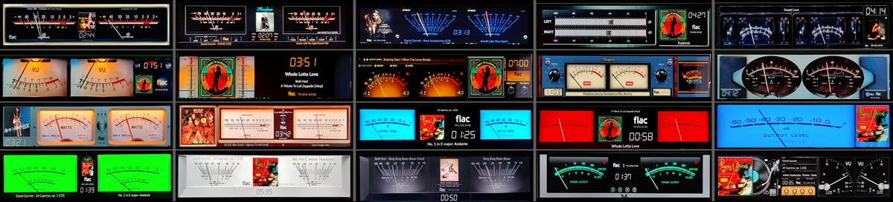

# 320 Templates

VU Meter templates for PeppyMeter Screensaver.

---

## 1480x320_g5_501_meters

| Property | Value |
|----------|-------|
| Template Pack | Yes (20 templates) |
| Meter Type | circular |
| Extended Config | Yes |
| Spectrum | No |
| Album Art | Yes |

**Included Meters:**

- 01G5_Accuphase
- 02G5_Accuphase Black
- 03G5_Advance X220
- 04G5_Rose Single Line
- 05G5_Audio Research
- 06G5_Kenwood Rev
- 07G5_Kenwood Single
- 08G5_Klanghelm
- 09G5_Klangheim Mojo
- 10G5_Krell KAS
- 11G5_Line Magnetic
- 12G5_Luxman
- 13G5_McIntosh
- 14G5_McIntosh RED
- 15G5_McIntosh Mono
- 16G5_Naim
- 17G5_Technics
- 18G5_Technics Black
- 19G5_T+A 3000HV
- 20G5_Turntable Black

**Download:** [1480x320_g5_501_meters.zip](1480x320_g5_501_meters.zip)

**Install:** Extract and copy folder to `/data/INTERNAL/peppy_screensaver/templates/`

---

## Installation

1. Download the desired template zip(s)
2. Extract each to the path shown next to its download link
3. Select in plugin settings

---

*Part of [PeppyMeter Templates](https://github.com/foonerd/peppy_templates)*
