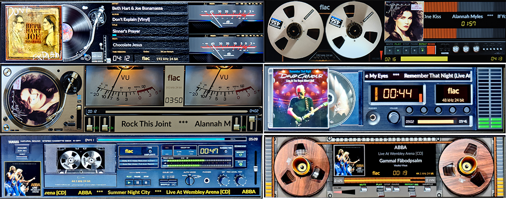

# 480 Templates

VU Meter templates for PeppyMeter Screensaver.

---

## 1920x480_30g5_810

| Property | Value |
|----------|-------|
| Template Pack | Yes (30 templates) |
| Meter Type | circular |
| Extended Config | Yes |
| Spectrum | No |
| Album Art | Yes |

**Included Meters:**

- 01G5_Naim
- 02G5_McIntosh C12000
- 03G5_Accuphase E8000 Led
- 04G5_Brianworks
- 05G5_Advanced X220
- 06G5_Old Meter
- 07G5_NAD C3050
- 08G5_Hitachi HMA7500
- 09G5_Kenwood Rev
- 10G5_Accuphase Rev
- 11G5_Accuphase
- 12G5_Luxman
- 13G5_BlackBlur
- 14G5_Turntable Black
- 15G5_Sansui Vertical
- 16G5_Sansui Horizontal
- 17G5_Sleepy
- 18G5_Dorrough
- 19G5_Kruger&Matz
- 20G5_Dagostino
- 21G5_Technics Silver
- 22G5_Technics Black
- 23G5_Technics Gold
- 24G5_Marantz CD
- 25G5_Led Strips
- 26G5_Casette Full
- 27G5_Saba
- 28G5_Furex
- 29G5_Loudspeaker_OUT
- 30G5_Eher

**Download:** [1920x480_30g5_810.zip](1920x480_30g5_810.zip)

**Install:** Extract and copy folder to `/data/INTERNAL/peppy_screensaver/templates/`

---

## 1920x480_g5_811_meters

| Property | Value |
|----------|-------|
| Template Pack | Yes (3 templates) |
| Meter Type | circular |
| Extended Config | Yes |
| Spectrum | No |
| Album Art | Yes |

**Included Meters:**

- 101G5_Turntable Black
- 102G5_Ampex Reel
- 103G5_Pioneer Gold

**Download:** [1920x480_g5_811_meters.zip](1920x480_g5_811_meters.zip)

**Install:** Extract and copy folder to `/data/INTERNAL/peppy_screensaver/templates/`

---

## 1920x480_g5_820_basic

| Property | Value |
|----------|-------|
| Template Pack | Yes (8 templates) |
| Meter Type | circular |
| Extended Config | Yes |
| Spectrum | No |
| Album Art | No |

**Included Meters:**

- 31G5_NAD only meters
- 32G5_Nakamichi only meters
- 33G5_DF202 Only meters
- 34G5_T+A
- 35G5_Luxman ONLY
- 36G5_Namson Only
- 37G5_Angstrom only
- 38G5_Caltecc ony meters

**Download:** [1920x480_g5_820_basic.zip](1920x480_g5_820_basic.zip)

**Install:** Extract and copy folder to `/data/INTERNAL/peppy_screensaver/templates/`

---

## Installation

1. Download the desired template zip(s)
2. Extract each to the path shown next to its download link
3. Select in plugin settings

---

*Part of [PeppyMeter Templates](https://github.com/foonerd/peppy_templates)*
