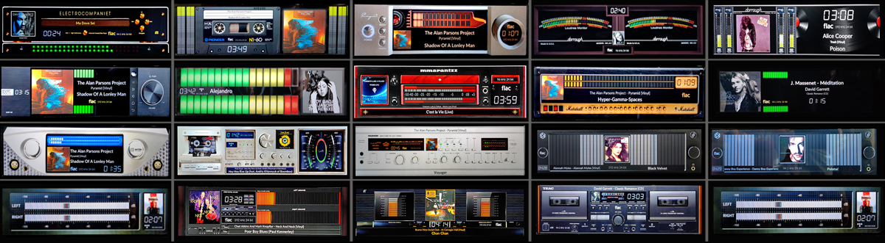
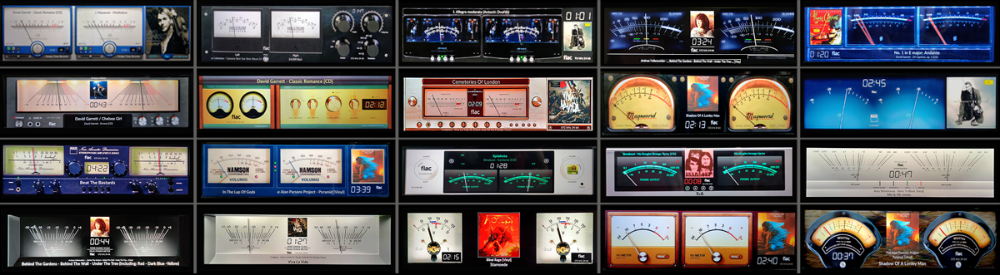

# 515 Templates

VU Meter templates for PeppyMeter Screensaver.

---

## 1920x515_g5_901_mbasic

| Property | Value |
|----------|-------|
| Template Pack | Yes (20 templates) |
| Meter Type | circular |
| Extended Config | Yes |
| Spectrum | No |
| Album Art | Yes |

**Included Meters:**

- 01G5_BlackBlur ONLY
- 02G5_Naim ONLY
- 03G5_Sansui Ver ONLY
- 04G5_Luxman ONLY
- 05G5_Angstrom only
- 06G5_NAD only meters
- 07G5_Audio Research Only
- 08G5_Hitachi7500 ONLY
- 09G5_Kenwood Rev ONLY
- 10G5_Dark Spot Only
- 11G5_DF202 Only
- 12G5_Tonnica ONLY
- 13G5_Eher ONLY
- 14G5_Weston ONLY
- 15G5_SG ONLY
- 16G5_Gemonti ONLY
- 17G5_Philmore Only
- 18G5_Namson Only
- 19G5_Nakamichi only
- 20G5_AKAI Rev

**Download:** [1920x515_g5_901_mbasic.zip](1920x515_g5_901_mbasic.zip)

**Install:** Extract and copy folder to `/data/INTERNAL/peppy_screensaver/templates/`

---

## 1920x515_g5_902_meters

| Property | Value |
|----------|-------|
| Template Pack | Yes (20 templates) |
| Meter Type | circular |
| Extended Config | Yes |
| Spectrum | No |
| Album Art | Yes |

**Included Meters:**

- 21G5_Accuphase
- 22G5_Accuphase E8000 Led
- 23G5_Accuphase E380
- 24G5_Accuphase Rev
- 25G5_Advanced EVO
- 26G5_Advanced X220
- 27G5_Brianworks
- 28G5_Hitachi HMA7500
- 29G5_Kenwood Rev
- 30G5_McIntosh Hybrid
- 31G5_McIntosh C12000
- 32G5_McIntosh Rev
- 33G5_Naim Rev
- 34G5_Naim
- 35G5_Krell
- 36G5_Krell KAS
- 37G5_Klanghelm
- 38G5_Klangheim Mojo
- 39G5_TURNTABLE Black
- 40G5_Line Magnetic

**Download:** [1920x515_g5_902_meters.zip](1920x515_g5_902_meters.zip)

**Install:** Extract and copy folder to `/data/INTERNAL/peppy_screensaver/templates/`

---

## 1920x515_g5_903_meters

| Property | Value |
|----------|-------|
| Template Pack | Yes (20 templates) |
| Meter Type | linear |
| Extended Config | Yes |
| Spectrum | No |
| Album Art | Yes |

**Included Meters:**

- 41G5_Electrocompanient
- 42G5_Casette Full
- 43G5_Cayin
- 44G5_Dorrough Border Braun
- 45G5_Dorrough Vertical
- 46G5_Eversolo
- 47G5_Led Strips
- 48G5_Marantz CD
- 49G5_Marshall
- 50G5_Modern
- 51G5_Mytek
- 52G5_PioneerCT LED
- 53G5_Radmor 5412
- 54G5_Rose IN
- 55G5_Rose OUT
- 56G5_Rose3 Line
- 57G5_Sansui Horizontal
- 58G5_Sansui Vertical
- 59G5_Teac Cassette
- 60G5_Telefunken Line

**Download:** [1920x515_g5_903_meters.zip](1920x515_g5_903_meters.zip)

**Install:** Extract and copy folder to `/data/INTERNAL/peppy_screensaver/templates/`

---

## 1920x515_g5_904_meters

| Property | Value |
|----------|-------|
| Template Pack | Yes (20 templates) |
| Meter Type | circular |
| Extended Config | Yes |
| Spectrum | No |
| Album Art | Yes |

**Included Meters:**

- 61G5_Alvin
- 62G5_Angstrom Black
- 63G5_Audio Research 160S
- 64G5_BlackBlur
- 65G5_EAM
- 66G5_Kruger&Matz Rev
- 67G5_Leben
- 68G5_Luxman
- 69G5_Magnetcord
- 70G5_NAD M10
- 71G5_NAD C3050
- 72G5_Namson
- 73G5_T+A 3100HV Silver
- 74G5_T+A 3000HV
- 75G5_Technics Black
- 76G5_Technics Silver
- 77G5_Technics Gold
- 78G5_Simens
- 79G5_Sleepy
- 80G5_Weston

**Download:** [1920x515_g5_904_meters.zip](1920x515_g5_904_meters.zip)

**Install:** Extract and copy folder to `/data/INTERNAL/peppy_screensaver/templates/`

---

## Installation

1. Download the desired template zip(s)
2. Extract each to the path shown next to its download link
3. Select in plugin settings

---

*Part of [PeppyMeter Templates](https://github.com/foonerd/peppy_templates)*
