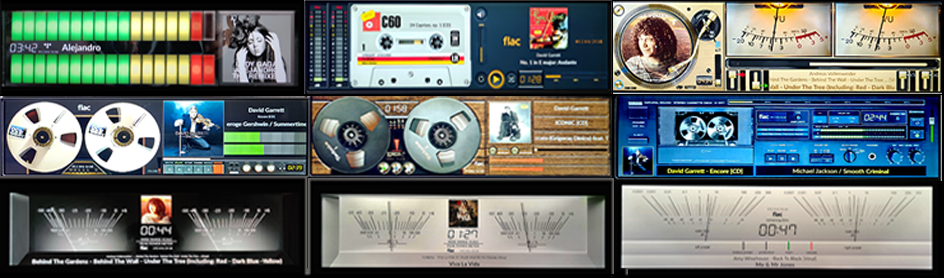
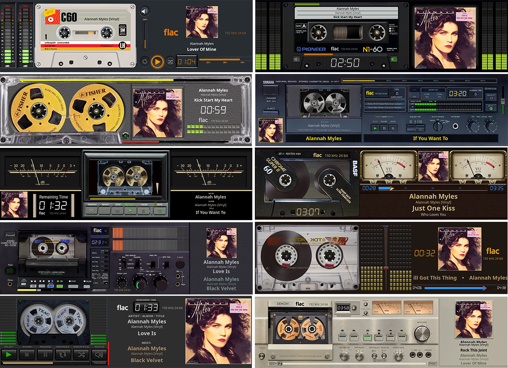
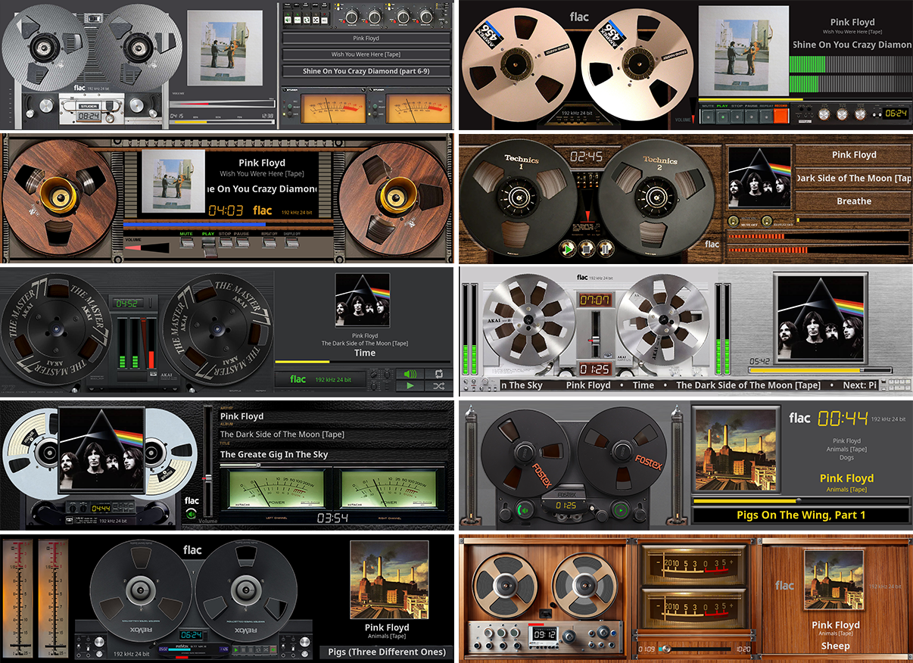
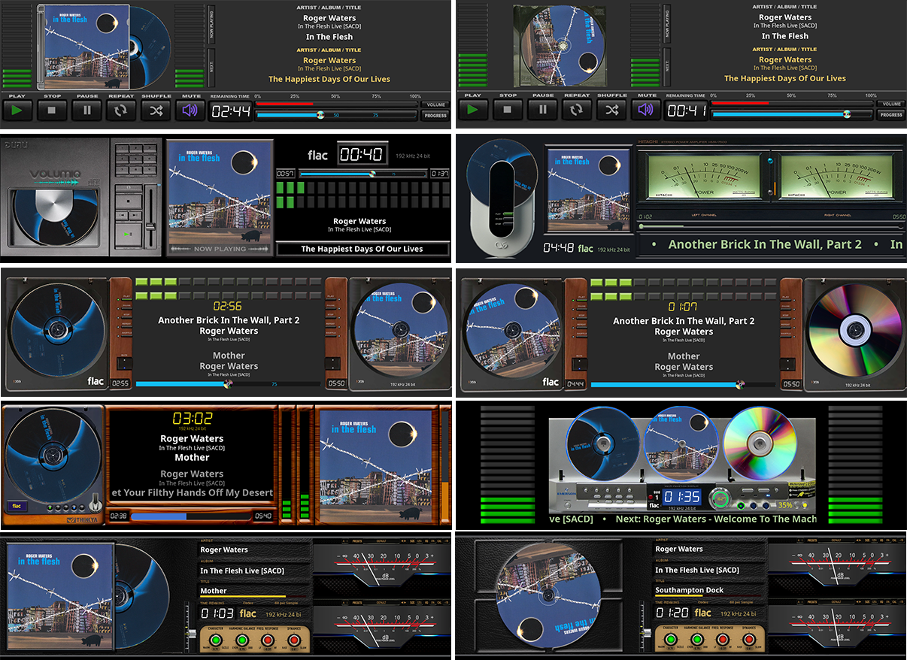

# 550 Templates

VU Meter templates for PeppyMeter Screensaver.

---

## 1920x550_g5_901_meters

| Property | Value |
|----------|-------|
| Template Pack | Yes (10 templates) |
| Meter Type | circular |
| Extended Config | Yes |
| Spectrum | No |
| Album Art | Yes |

**Included Meters:**

- 01G5_AKAI Rev
- 02G5_Casette Full
- 03G5_Hitachi HMA7500
- 04G5_Kenwood Rev
- 05G5_Kenwood Deck
- 06G5_McIntosh Hybrid
- 07G5_NAD C3050
- 08G5_Naim
- 09G5_Old Meter
- 10G5_Sansui Horizontal

**Download:** [1920x550_g5_901_meters.zip](1920x550_g5_901_meters.zip)

**Install:** Extract and copy folder to `/data/INTERNAL/peppy_screensaver/templates/`

---

## 1920x550_g5_902_meters

| Property | Value |
|----------|-------|
| Template Pack | Yes (9 templates) |
| Meter Type | linear |
| Extended Config | Yes |
| Spectrum | No |
| Album Art | Yes |

**Included Meters:**

- 100G5_Led Strips
- 101G5_Technics Black
- 102G5_Technics Silver
- 103G5_Technics Gold
- 104G5_Pioneer Gold
- 105G5_Ampex Reel
- 106G5_TDK Reel
- 107G5_Yamaha CD
- 108G5_Cassette_Linear

**Download:** [1920x550_g5_902_meters.zip](1920x550_g5_902_meters.zip)

**Install:** Extract and copy folder to `/data/INTERNAL/peppy_screensaver/templates/`

---

## 1920x550_g5_910_turntables

| Property | Value |
|----------|-------|
| Template Pack | Yes (18 templates) |
| Meter Type | circular |
| Extended Config | Yes |
| Spectrum | No |
| Album Art | Yes |

**Included Meters:**

- 101G5_02_Pioneer Gold
- 101G5_03_Pioneer Gold
- 102G5_Denon DP62
- 103G5_Denon DP400
- 104G5_Thorens
- 104G5_02_Thorens
- 105G5_TURNTABLE Black
- 106G5_McIntosh MTI100
- 106G5_02_McIntosh MTI100
- 107G5_Grandioso
- 108G5_Crosley Turntable
- 108G5_02_Crosley Turntable
- 109G5_Gramovox
- 110G5_SME60
- 110G5_02_SME60
- 111G5_Vertere Turn
- 111G5_02_Vertere Turn
- 112G5_TechDas

**Download:** [1920x550_g5_910_turntables.zip](1920x550_g5_910_turntables.zip)

**Install:** Extract and copy folder to `/data/INTERNAL/peppy_screensaver/templates/`

---

## 1920x550_g5_913_Cassette

| Property | Value |
|----------|-------|
| Template Pack | Yes (10 templates) |
| Meter Type | linear |
| Extended Config | Yes |
| Spectrum | No |
| Album Art | Yes |

**Included Meters:**

- 130G5_Cassette_Linear
- 131G5_Cassette Pioneer
- 132G5_Fisher cassette
- 133G5_Yamaha
- 134G5_TEAC cassette
- 135G5_BASF Free
- 136G5_Sansui Cassette
- 137G5_TDK cassette
- 138G5_TEAC Full
- 139G5_Denon DR650

**Download:** [1920x550_g5_913_Cassette.zip](1920x550_g5_913_Cassette.zip)

**Install:** Extract and copy folder to `/data/INTERNAL/peppy_screensaver/templates/`

---

## 1920x550_g5_915_Tape_Recorder

| Property | Value |
|----------|-------|
| Template Pack | Yes (10 templates) |
| Meter Type | circular |
| Extended Config | Yes |
| Spectrum | No |
| Album Art | Yes |

**Included Meters:**

- 150G5_Studer A810
- 151G5_Ampex Reel
- 152G5_Otari Reel
- 153G5_TDK Reel
- 154G5_Akai 77
- 155G5_Akai77_silver
- 156G5_TapeAK
- 157G5_Fostex Rec
- 158G5_Revox B77
- 159G5_MION24

**Download:** [1920x550_g5_915_Tape_Recorder.zip](1920x550_g5_915_Tape_Recorder.zip)

**Install:** Extract and copy folder to `/data/INTERNAL/peppy_screensaver/templates/`

---

## 1920x550_g5_917_CD

| Property | Value |
|----------|-------|
| Template Pack | Yes (10 templates) |
| Meter Type | linear |
| Extended Config | Yes |
| Spectrum | No |
| Album Art | Yes |

**Included Meters:**

- 190G5_CD Player Full
- 190G5_02_CD Player Full
- 191G5_DUNU
- 192G5_Shanling Cust
- 193G5_Syitren Cust
- 193G5_02_Syitren
- 194G5_Thinkya Cust
- 195G5_CD Black
- 195G5_02_CD Black
- 196G5_Emerson MS3

**Download:** [1920x550_g5_917_CD.zip](1920x550_g5_917_CD.zip)

**Install:** Extract and copy folder to `/data/INTERNAL/peppy_screensaver/templates/`

---

## Installation

1. Download the desired template zip(s)
2. Extract each to the path shown next to its download link
3. Select in plugin settings

---

*Part of [PeppyMeter Templates](https://github.com/foonerd/peppy_templates)*
