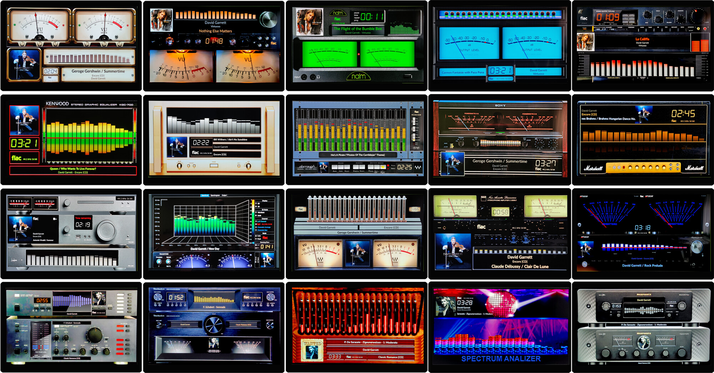

# 1080 Templates

VU Meter with Spectrum overlay templates.

---

## 1920x1080_20g5_spectr

| Property | Value |
|----------|-------|
| Template Pack | Yes (20 templates) |
| Meter Type | spectrum |
| Extended Config | No |
| Spectrum | Yes |
| Album Art | No |

**Included Meters:**

- Free
- Sansui
- Kenwood
- Naim
- McIntosh
- Lynx
- Nixie
- Nixi2
- NadHD
- Adven
- Sony
- Kenwood Big
- M6100
- Dorrought
- Marschal
- Neon
- Marantz
- Technics
- SansuiTU
- OPipe2

> **Important:** This template is part of a set. Both parts must be installed for the meters to work correctly.

**Complete Set (both required):**

- VU Meter + Spectrum: [1920x1080_20g5_spectr.zip](1920x1080_20g5_spectr.zip) -> `/data/INTERNAL/peppy_screensaver/templates_spectrum/`
- VU Meter: [1920x1080_20g5_meter.zip](../../../template_peppy/1920/1080/1920x1080_20g5_meter.zip) -> `/data/INTERNAL/peppy_screensaver/templates/`

---

## Installation

1. Download the desired template zip(s)
2. Extract each to the path shown next to its download link
3. Select in plugin settings

---

*Part of [PeppyMeter Templates](https://github.com/foonerd/peppy_templates)*
