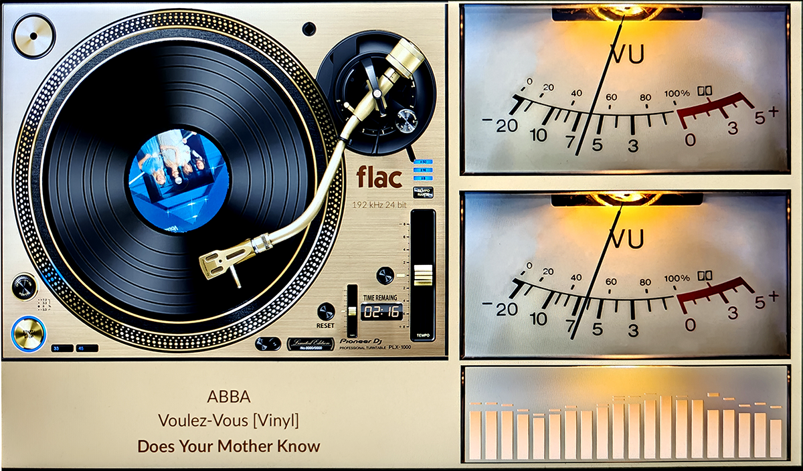

# 1080 Templates

Combined VU Meter + Spectrum templates (self-contained with both parts).

---

## 1920x1080_20g5

| Property | Value |
|----------|-------|
| Template Pack | Yes (20 templates) |
| Meter Type | circular |
| Extended Config | Yes |
| Spectrum | Yes |
| Album Art | Yes |

**Included Meters:**

- 101G5_Free S+M
- 102G5_Sansui S+M
- 103G5_Kenwood S+M
- 104G5_Naim S+M
- 105G5_McIntosh S+M
- 106G5_Lyngdorf S+M
- 107G5_Nixie S+M
- 108G5_NIxI2 S+M
- 109G5_NAD C3050HD S+M
- 110G5_Advanced X220 S+M
- 111G5_Sony TAN77 S+M
- 112G5_Kenwood Spectrum
- 113G5_M6100Gold Spectrum
- 114G5_Dorrought Spectrum
- 115G5_Neon Disco Spectrum
- 116G5_Marschal Spectrum
- 117G5_Marantz S+M
- 118G5_Technics S+M
- 119G5_Sansui TU S7
- 120G5_OldPipe Spectrum

**Download:** [1920x1080_20g5.zip](1920x1080_20g5.zip)

**Install (both required):**
1. Extract the zip file
2. Copy `templates/` contents to `/data/INTERNAL/peppy_screensaver/templates/`
3. Copy `templates_spectrum/` contents to `/data/INTERNAL/peppy_screensaver/templates_spectrum/`

---

## 1920x1080_g5_721_ms

| Property | Value |
|----------|-------|
| Meter Name | 121G5_Pioneer S+M |
| Meter Type | circular |
| Extended Config | Yes |
| Spectrum | Yes |
| Album Art | Yes |

**Download:** [1920x1080_g5_721_ms.zip](1920x1080_g5_721_ms.zip)

**Install (both required):**
1. Extract the zip file
2. Copy `templates/` contents to `/data/INTERNAL/peppy_screensaver/templates/`
3. Copy `templates_spectrum/` contents to `/data/INTERNAL/peppy_screensaver/templates_spectrum/`

---

## Installation

1. Download the desired template zip(s)
2. Extract each to the path shown next to its download link
3. Select in plugin settings

---

*Part of [PeppyMeter Templates](https://github.com/foonerd/peppy_templates)*
